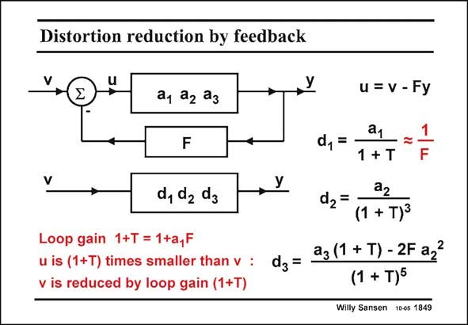

# SANSEN-1849 · Distortion reduction by feedback

章节：18 基本晶体管电路的失真  
PDF 页：533；书本页：543；幻灯片编号：1849  
状态：unreviewed



## 对应教材讲解

### PDF 532 · 书本 542

The open-loop gain a is divided by the loop gain 1+T, as expected (1+LG in Chapter 13). 1 For large T, the closed-loop gain d is just about 1/F, as explained by first-order feedback theory 1 (see Chapter 13). The second-order coefficient d of the power series with feedback, is given to a but divided 2 2 by the third power of the loop gain T.

### PDF 533 · 书本 543

The third-order coefficient d of the power series 3 with feedback, is given to a 3 but is now divided by the fifth power of the loop gain T. Actually, a gives a con- 2 tribution. The second-order distortion of the nonlinear amplifier can take one more turn through the loop to generate third-order distortion. However, it has the opposite sign of the contribution from a . Coefficient 3 a gives compression dis- 3 tortion, whereas a gives 2 expansion of the sine wave. They can cancel out at one particular value of the coefficients a. The distortion components are now easily calculated.

## 公式／性能结论候选摘录

以下为规则截取的原文，尚未逐项判读。

- PDF 532: The open-loop gain a is divided by the loop gain 1+T, as expected (1+LG in Chapter 13). 1 For large T, the closed-loop gain d is just about 1/F, as explained by first-order feedback theory 1 (see Chapter 13).
- PDF 532: The second-order coefficient d of the power series with feedback, is given to a but divided 2 2 by the third power of the loop gain T.
- PDF 533: The third-order coefficient d of the power series 3 with feedback, is given to a 3 but is now divided by the fifth power of the loop gain T.

## 曲线结论候选摘录

以下为规则截取的原文，尚未逐项判读。

（未由规则找到；不代表原页没有此类内容。）

## 原文条件与近似候选摘录

以下为规则截取的原文，尚未逐项判读。

（未由规则找到；不代表原页没有此类内容。）

## 幻灯片 OCR（未校正）

```text
Distortion reduction by feedback
V
a, 22 23
F
d, de dg
Loop gain 1+T = 1+a,F
u is (1+T) times smaller than v :
v is reduced by loop gain (1+T)
dz =
u = v - Fy
a1
d, =
1 + T
a2
d2=
(1 + T)3
a3 (1 + T) - 2F a2?
(1 + T)5
Willy Sansen 10-05 1849
```

数学上下标、分数及正负号以原图为准。电路图已保留；未核对的连接不输出成可仿真 netlist。
