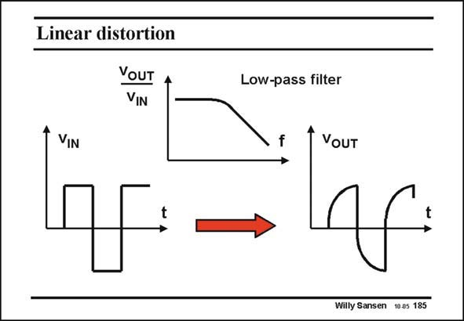

# SANSEN-185 · Linear distortion

章节：18 基本晶体管电路的失真  
PDF 页：511；书本页：521；幻灯片编号：185  
状态：unreviewed



## 对应教材讲解

### PDF 511 · 书本 521

A similar effect is seen for low-pass filters. Any lowpass filter will eliminate the steep edges of a square waveform, as they represent the higher frequencies. The output waveform is now rounded. It is again different from the input waveform, and is distorted. This kind of linear distortion occurs for all filters. It will not be discussed any further.

## 公式／性能结论候选摘录

以下为规则截取的原文，尚未逐项判读。

（未由规则找到；不代表原页没有此类内容。）

## 曲线结论候选摘录

以下为规则截取的原文，尚未逐项判读。

（未由规则找到；不代表原页没有此类内容。）

## 原文条件与近似候选摘录

以下为规则截取的原文，尚未逐项判读。

（未由规则找到；不代表原页没有此类内容。）

## 幻灯片 OCR（未校正）

```text
Linear distortion
YOUT
VIN
Low-pass filter
VIN
VouT
Willy Sansen 10.05 185
```

数学上下标、分数及正负号以原图为准。电路图已保留；未核对的连接不输出成可仿真 netlist。
