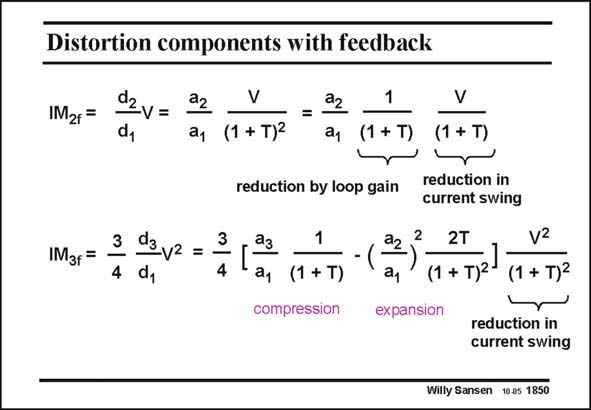

# SANSEN-1850 · Distortion components with feedback

章节：18 基本晶体管电路的失真  
PDF 页：533；书本页：543；幻灯片编号：1850  
状态：unreviewed



## 对应教材讲解

### PDF 533 · 书本 543

By use of the coefficients d, the distortion components IM and IM with feed- 2f 3f back (index f ) are easily calculated. The IM contains T2 in 2f the denominator. If we associate one T to the reduction of the gain, and as a consequence, the reduction of the relative current swing, then we see that the IM is 2f reduced by T itself. A rule of thumb is that we calculate the distortion for the relative current swing, taking into account the effect of the feedback on this current swing. The distortion for this stage is now easily calculated. It is divided by the loop gain to take into account the reduction by the loop gain T. In the same way, IM is calculated. Again, the two terms appear related to a and a . If a is 3f 3 2 3 dominant, the same rule of thumb applies. An easy way to calculate the distortion is to find the distortion for a relative current swing, taking into account the effect of feedback. The distortion is then obtained by division by the loop gain T itself, and not by T2. The same is true if a is dominant. Indeed the T2 in the denominator is reduced to T since 2 the numerator also contains T. Clearly, we have assumed all along that T is always larger than unity and that the loop gain can be represented by T, rather than 1+T.

## 公式／性能结论候选摘录

以下为规则截取的原文，尚未逐项判读。

- PDF 533: If we associate one T to the reduction of the gain, and as a consequence, the reduction of the relative current swing, then we see that the IM is 2f reduced by T itself.
- PDF 533: It is divided by the loop gain to take into account the reduction by the loop gain T.
- PDF 533: The distortion is then obtained by division by the loop gain T itself, and not by T2.
- PDF 533: Clearly, we have assumed all along that T is always larger than unity and that the loop gain can be represented by T, rather than 1+T.

## 曲线结论候选摘录

以下为规则截取的原文，尚未逐项判读。

（未由规则找到；不代表原页没有此类内容。）

## 原文条件与近似候选摘录

以下为规则截取的原文，尚未逐项判读。

- PDF 533: Clearly, we have assumed all along that T is always larger than unity and that the loop gain can be represented by T, rather than 1+T.

## 幻灯片 OCR（未校正）

```text
Distortion components with feedback
IM2f =
dzv=
IM3f =
3 d3y2 = 3
4 dy
V
a1 (1 + T)-
1
V
a1
(1 + T)
(1 + T)
reduction by loop gain
reduction in
current swing
a, (1 + T)
compression
a2
2
21
expansion
2T
(1 + т)2
v2
(1 + T)2
reduction in
current swing
Willy Sansen 10.05 1850
```

数学上下标、分数及正负号以原图为准。电路图已保留；未核对的连接不输出成可仿真 netlist。
