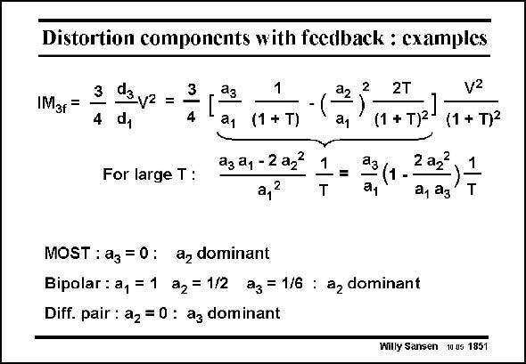

# SANSEN-1851 · Distortion components with fecdback : examples

章节：18 基本晶体管电路的失真  
PDF 页：534；书本页：544；幻灯片编号：1851  
状态：unreviewed



## 对应教材讲解

### PDF 534 · 书本 544

The factor between square brackets can be rewritten provided T is large, as shown in this slide. Which term is dominant, depends on the actual transistor configuration. Three examples are given. A MOST in the stronginversion region has a zero a . It is clear that in 3 this case, all third-order distortion is due to a . 2 Application of feedback around a single-transistor MOST amplifier generates third-order distortion, which is not present without feedback. For a single bipolar-transistor amplifier the coefficients are given in this slide. This yields as a second term with a a value of 3. Clearly, this latter term is now dominant. 2 A differential pair, on the other hand, does not have second-order distortion; its a is zero. As 2 a result, its IM is zero but not its IM . It is obviously caused by the third-order distortion a 2f 3f 3 of the open-loop amplifier.

## 公式／性能结论候选摘录

以下为规则截取的原文，尚未逐项判读。

- PDF 534: Which term is dominant, depends on the actual transistor configuration.

## 曲线结论候选摘录

以下为规则截取的原文，尚未逐项判读。

（未由规则找到；不代表原页没有此类内容。）

## 原文条件与近似候选摘录

以下为规则截取的原文，尚未逐项判读。

- PDF 534: The factor between square brackets can be rewritten provided T is large, as shown in this slide.

## 幻灯片 OCR（未校正）

```text
Distortion components with fecdback : examples
IM3f
3
4
03 V2 =
3
4
For large T :
aз
a1
(1 + T)
ag a1 - 2 a2?
a,2
a2
2
2T
(1 + T)2
v2
(1 + T)2
1
T
2 a2?
ay âg
1
T
MOST : az =0: a, dominant
Bipolar : a, = 1 a2 = 1/2 aз = 1/6 : a, dominant
Diff. pair: az =0: az dominant
Willy Sansen 10 05 1851
```

数学上下标、分数及正负号以原图为准。电路图已保留；未核对的连接不输出成可仿真 netlist。
