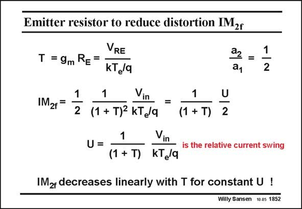

# SANSEN-1852 · Emitter resistor to reduce distortion IMzr

章节：18 基本晶体管电路的失真  
PDF 页：534；书本页：544；幻灯片编号：1852  
状态：unreviewed



## 对应教材讲解

### PDF 534 · 书本 544

One of the simplest amplifiers with feedback is a single bipolar-transistor amplifier with a series resistor R in E the Emitter. The loop gain is now simply g R , which m E is assumed to be larger than unity. It is also the DC voltage V across the resistor RE R , scaled by kT /q. E e Substitution of the ratio a /a into IM yields the 2 1 2f expression given in this slide. As predicted, the IM 2f is linearly proportional to the relative current swing U, and has to be divided by the loop gain 1+T, or by T itself for large T.

## 公式／性能结论候选摘录

以下为规则截取的原文，尚未逐项判读。

- PDF 534: The loop gain is now simply g R , which m E is assumed to be larger than unity.
- PDF 534: As predicted, the IM 2f is linearly proportional to the relative current swing U, and has to be divided by the loop gain 1+T, or by T itself for large T.

## 曲线结论候选摘录

以下为规则截取的原文，尚未逐项判读。

（未由规则找到；不代表原页没有此类内容。）

## 原文条件与近似候选摘录

以下为规则截取的原文，尚未逐项判读。

- PDF 534: The loop gain is now simply g R , which m E is assumed to be larger than unity.

## 幻灯片 OCR（未校正）

```text
Emitter resistor to reduce distortion IMzr
VRE
T = 9m RE =
KTe/q
a2 =
1
ay
2
IM2r=
1
2
1
Vin =
(1 + T)2 kT /q
1
(1 + T) 2
U
1
Vin
U =
is the relative current swing
(1 +T) KTe/q
IM2 decreases linearly with T for constant U !
Willy Sansen 10.05 1852
```

数学上下标、分数及正负号以原图为准。电路图已保留；未核对的连接不输出成可仿真 netlist。
