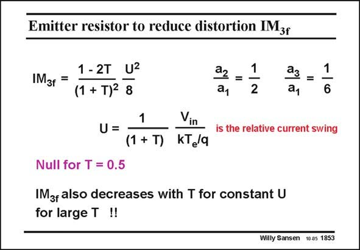

# SANSEN-1853 · Emitter resistor to reduce distortion IMzr

章节：18 基本晶体管电路的失真  
PDF 页：535；书本页：545；幻灯片编号：1853  
状态：unreviewed



## 对应教材讲解

### PDF 535 · 书本 545

Substitution of the ratio a /a and of a /a into IM 2 1 3 1 3f yields the expression given in this slide. As predicted, the IM is 3f proportional to the relative current swing U squared, and has to be divided by the loop gain 1+T, or by T itself for large T, not by T2! Note that there is a null for T=0.5. It is a very sharp null however, which cannot be easily used. This is shown in the next slide.

## 公式／性能结论候选摘录

以下为规则截取的原文，尚未逐项判读。

- PDF 535: As predicted, the IM is 3f proportional to the relative current swing U squared, and has to be divided by the loop gain 1+T, or by T itself for large T, not by T2!

## 曲线结论候选摘录

以下为规则截取的原文，尚未逐项判读。

（未由规则找到；不代表原页没有此类内容。）

## 原文条件与近似候选摘录

以下为规则截取的原文，尚未逐项判读。

（未由规则找到；不代表原页没有此类内容。）

## 幻灯片 OCR（未校正）

```text
Emitter resistor to reduce distortion IMzr
1- 2T U2
IM3f =
(1 + T)2 8
=
a1
=
a1
1
6
1
U=
Vin
is the relative current swing
(1 + T)
kTe/a
Null for T = 0.5
IMgfalso decreases with T for constant U
for large T !!
Willy Sansen 10.05 1853
```

数学上下标、分数及正负号以原图为准。电路图已保留；未核对的连接不输出成可仿真 netlist。
