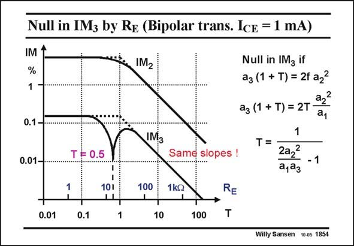

# SANSEN-1854 · Null in IM3 by Re (Bipolar trans. IcE = 1 mA)

章节：18 基本晶体管电路的失真  
PDF 页：535；书本页：545；幻灯片编号：1854  
状态：unreviewed



## 对应教材讲解

### PDF 535 · 书本 545

The results are plotted for a bipolar-transistor amplifier with an emitter resistor R E of increasing value. The DC current I is CE constant and so is the relative current swing. This means that the input voltage is constant up to T=1 and then increases with T. Note that for values of T larger than unity, both IM 2f and IM decrease with the 3f same slope of −20 dB/ decade. Note also that the IM shows a null at T=0.5, 3f which is quite sharp indeed.

## 公式／性能结论候选摘录

以下为规则截取的原文，尚未逐项判读。

- PDF 535: This means that the input voltage is constant up to T=1 and then increases with T.
- PDF 535: Note that for values of T larger than unity, both IM 2f and IM decrease with the 3f same slope of −20 dB/ decade.

## 曲线结论候选摘录

以下为规则截取的原文，尚未逐项判读。

- PDF 535: The results are plotted for a bipolar-transistor amplifier with an emitter resistor R E of increasing value.
- PDF 535: Note that for values of T larger than unity, both IM 2f and IM decrease with the 3f same slope of −20 dB/ decade.

## 原文条件与近似候选摘录

以下为规则截取的原文，尚未逐项判读。

（未由规则找到；不代表原页没有此类内容。）

## 幻灯片 OCR（未校正）

```text
Null in IM3 by Re (Bipolar trans. IcE = 1 mA)
IM 1
%
1
0.1 -
0.01-
IM2
IM3
Null in IMz if
aз (1 + T) = 2f az?
T F 0.5
Same slopes !
a22
aз (1 + T) = 2T
a1
1
T=2a2
-1
a,aз
1
101
11
100
1kQ
0.01
0.1
1
10
100
RE
T
Willy Sansen 10.05 1854
```

数学上下标、分数及正负号以原图为准。电路图已保留；未核对的连接不输出成可仿真 netlist。
