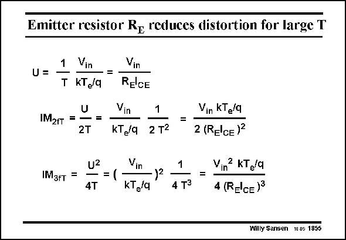

# SANSEN-1855 · Emitter resistor Re reduces distortion for large T

章节：18 基本晶体管电路的失真  
PDF 页：536；书本页：546；幻灯片编号：1855  
状态：unreviewed



## 对应教材讲解

### PDF 535 · 书本 545

For large loop gain T, simplified expressions can be obtained. Substitution of T by g R yields the second set of expressions. Substitution of g by the DC m E m current ICE divided by kT /q yields the last set of expressions. e They indicate what the relationships are between the IM and IM and the input voltage 2fT 3fT amplitude V , the DC current I and the resistor R . For constant I and input voltage V , in CE E CE in

### PDF 536 · 书本 546

and increasing R , the rela- E tive current swing decreases, decreasing the distortion components considerably. This is for a bipolar transistor. Let us have a look now at a MOST with a series resistor R in the S Source.

## 公式／性能结论候选摘录

以下为规则截取的原文，尚未逐项判读。

- PDF 535: For large loop gain T, simplified expressions can be obtained.
- PDF 536: and increasing R , the rela- E tive current swing decreases, decreasing the distortion components considerably.

## 曲线结论候选摘录

以下为规则截取的原文，尚未逐项判读。

（未由规则找到；不代表原页没有此类内容。）

## 原文条件与近似候选摘录

以下为规则截取的原文，尚未逐项判读。

（未由规则找到；不代表原页没有此类内容。）

## 幻灯片 OCR（未校正）

```text
Emitter resistor Re reduces distortion for large T
1
Vin
Vin
U=
-=
T KT/9
RElCE
U
IM2rт = -
-=
2T
Vin
1
kT,/q
2 T2
=
Vin KT /9
2 (RElce)
IMзfт
=
U2
Vin
==(
-)2
4T
kT /a
1
4 T3
=
Vin KT8/a
4 (RECE)3
Willy Sansen 10 05 1855
```

数学上下标、分数及正负号以原图为准。电路图已保留；未核对的连接不输出成可仿真 netlist。
