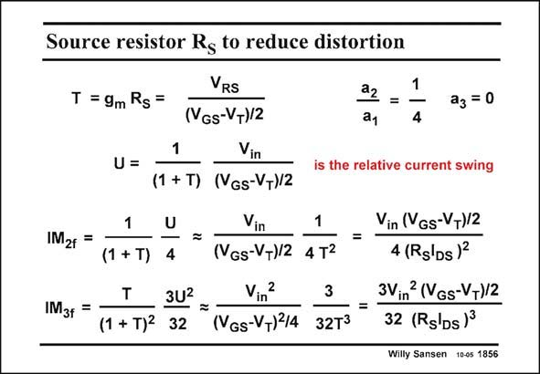

# SANSEN-1856 · Source resistor Rg to reduce distortion

章节：18 基本晶体管电路的失真  
PDF 页：536；书本页：546；幻灯片编号：1856  
状态：unreviewed



## 对应教材讲解

### PDF 536 · 书本 546

For a MOST, the third order coefficient a is zero. 3 The third-order distortion with feedback, will therefore be caused by the secondorder coefficient a . 2 Another big difference between a bipolar transistor and a MOST is that the kT /q must be substituted e by (V −V )/2, which can GS T be chosen, but which is always larger than kT /q. e For low distortion, a small value of V −V must also GS T be selected, because the effect of the increase in g , and in loop gain T is more important than the decrease of the m V −V . GS T For large T, similar results are obtained as for a bipolar transistor. Substitution of T by g R m S also yields expressions which are very similar to the ones for a bipolar transistor. For example, for IM the coefficient is about 1/10, whereas 1/4 for a bipolar transistor. It is 3fT therefore 2.5 times smaller than for a bipolar transistor. However, if V −V =0.2 V is chosen, GS T then (V −V )/2=0.1 V which is four times larger than kT /q×26 mV. For the same DC GS T e current and resistor, the MOST amplifier gives 4/2.5 or about 1.6 times worse IM than a bipolar 3 amplifier, for the same input voltage.

## 公式／性能结论候选摘录

以下为规则截取的原文，尚未逐项判读。

- PDF 536: For a MOST, the third order coefficient a is zero. 3 The third-order distortion with feedback, will therefore be caused by the secondorder coefficient a . 2 Another big difference between a bipolar transistor and a MOST is that the kT /q must be substituted e by (V −V )/2, which can GS T be chosen, but which is always larger than kT /q. e For low distortion, a small value of V −V must also GS T be selected, because the effect of the increase in g , and in loop gain T is more important than the decrease of the m V −V .
- PDF 536: It is 3fT therefore 2.5 times smaller than for a bipolar transistor.

## 曲线结论候选摘录

以下为规则截取的原文，尚未逐项判读。

（未由规则找到；不代表原页没有此类内容。）

## 原文条件与近似候选摘录

以下为规则截取的原文，尚未逐项判读。

（未由规则找到；不代表原页没有此类内容。）

## 幻灯片 OCR（未校正）

```text
Source resistor Rg to reduce distortion
VRS
T = 9m Rs =
(VGs-V+)/2
a2 =
1
a1
4
Vin
a3 = 0
U =
1
(1 + T) (VGs-V+)/2
is the relative current swing
IM2f
IM3f
=
Vin
1
(1 + T)
4
(VGs-VT)/2 4 T2
3U2 = -
Vin
2
3
(1 + T)2 32
(VGs-VT)14 32T3
=
Vin (VGs-VT)/2
4 (Rslds)2
3Vin2 (VGs-V+)/2
32 (Rg'ds)3
Willy Sansen 10-0s 1856
```

数学上下标、分数及正负号以原图为准。电路图已保留；未核对的连接不输出成可仿真 netlist。
