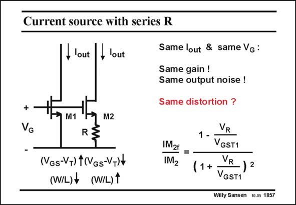

# SANSEN-1857 · Current source with series R

章节：18 基本晶体管电路的失真  
PDF 页：537；书本页：547；幻灯片编号：1857  
状态：unreviewed



## 对应教材讲解

### PDF 537 · 书本 547

The question arises whether it is better for low distortion, to take a MOST with large V −V (as for MOST GS T M1), or to take MOST with small V −V and a series GS T resistor R (as for MOST 2). The difference between the V and the V is the GS1 GS2 voltage across the resistor V . R The Gates are at the same voltage V . We also take G equal DC currents. It is clear that for thirdorder distortion IM , the 3 configuration with M1 is the best as it does not give any IM . The one with feedback resistor 3 R does give IM ! 3f For second-order distortion IM (for M1) and IM (for M2), we have to calculate the ratio 2 2f IM /IM . The result is given in this slide. 2f 2 It shows that the voltage across the resistor V must be larger than V −V (or V ) to R GS1 T GST1 make a difference. If this is the case, the distortion is inversely proportional to the voltage V . R For second-order distortion, it is better to use as large a resistor as possible, but not for thirdorder distortion!

## 公式／性能结论候选摘录

以下为规则截取的原文，尚未逐项判读。

- PDF 537: We also take G equal DC currents.
- PDF 537: If this is the case, the distortion is inversely proportional to the voltage V .

## 曲线结论候选摘录

以下为规则截取的原文，尚未逐项判读。

（未由规则找到；不代表原页没有此类内容。）

## 原文条件与近似候选摘录

以下为规则截取的原文，尚未逐项判读。

（未由规则找到；不代表原页没有此类内容。）

## 幻灯片 OCR（未校正）

```text
Current source with series R
,lout lout
+
M1
M2
R
(NGs-V+) tINGs-VNt
(W/L)t (W/L)1
Same lout & same Vg :
Same gain !
Same output noise !
Same distortion ?
IM2t =
IM2
VR
1 -
VGST1
VR
(1+
)2
VGST1
Willy Sansen 10a5 1857
```

数学上下标、分数及正负号以原图为准。电路图已保留；未核对的连接不输出成可仿真 netlist。
