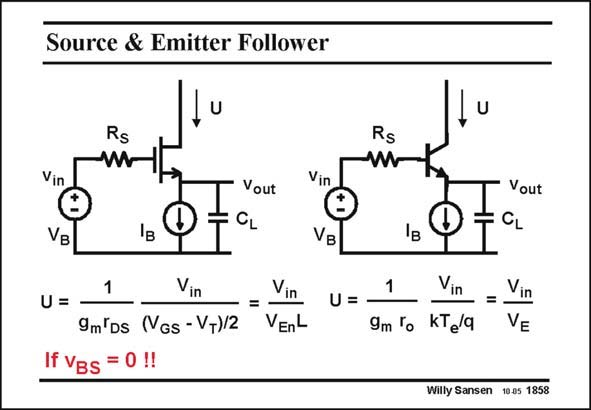

# SANSEN-1858 · Source & Emitter Follower

章节：18 基本晶体管电路的失真  
PDF 页：537；书本页：547；幻灯片编号：1858  
状态：unreviewed



## 对应教材讲解

### PDF 537 · 书本 547

When the series resistor in the Source is greatly increased, i.e. when an ideal current source I is used B with infinite output resistance, then the distortion due to the non-linearity of the I −V characteristic DS GS is zero. In this case, the non-linearity of the output conductance is dominant. It can again be described in terms of relative current swing U, as given in this slide. Voltage V L is the Early voltage of E the MOST. The larger the Early voltage, the smaller the relative current swing and the smaller the distortion is. The same applies to an emitter follower. We have silently assumed that the Bulk-Source voltage of the source follower is zero. This is

### PDF 538 · 书本 548

only possible when the Bulk can be connected to the source or when the nMOST is in a p-well. However, CMOS processes have normally a n-well. A nMOST source follower has normally its Bulk connected to ground. This causes a lot of distortion, as shown next.

## 公式／性能结论候选摘录

以下为规则截取的原文，尚未逐项判读。

- PDF 537: When the series resistor in the Source is greatly increased, i.e. when an ideal current source I is used B with infinite output resistance, then the distortion due to the non-linearity of the I −V characteristic DS GS is zero.

## 曲线结论候选摘录

以下为规则截取的原文，尚未逐项判读。

- PDF 537: When the series resistor in the Source is greatly increased, i.e. when an ideal current source I is used B with infinite output resistance, then the distortion due to the non-linearity of the I −V characteristic DS GS is zero.

## 原文条件与近似候选摘录

以下为规则截取的原文，尚未逐项判读。

- PDF 537: We have silently assumed that the Bulk-Source voltage of the source follower is zero.

## 幻灯片 OCR（未校正）

```text
Source & Emitter Follower
U
Rs
Vin
Vout
VB
1
U=
If VBs = 0 !!
Vin
=
Vin
9m Ds (VGs - V+)/2 VEnL
Rs
W
Vin
Э
VB
U=
D
Vout
CL
1
Vin
=.
Vin
9m 'o
KTela
VE
Willy Sansen 10.05 1858
```

数学上下标、分数及正负号以原图为准。电路图已保留；未核对的连接不输出成可仿真 netlist。
