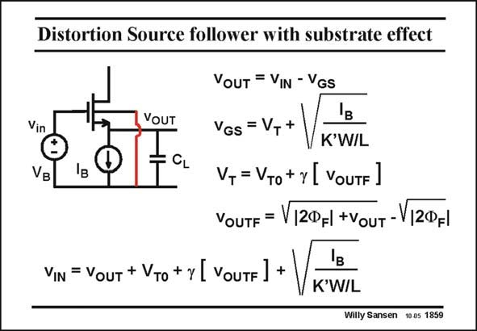

# SANSEN-1859 · Distortion Source follower with substrate effect

章节：18 基本晶体管电路的失真  
PDF 页：538；书本页：548；幻灯片编号：1859  
状态：unreviewed



## 对应教材讲解

### PDF 538 · 书本 548

Indeed, when the Bulk is connected to ground, the parasitic JFET becomes active (see Chapter 1), and the gain becomes smaller than unity. In this case, the threshold voltage V depends on the T output voltage through parameter c, which represents the body effect as explained in Chapter 1. The relation between input and output voltage is now easily derived. It is clearly a nonlinear relationship.

## 公式／性能结论候选摘录

以下为规则截取的原文，尚未逐项判读。

- PDF 538: Indeed, when the Bulk is connected to ground, the parasitic JFET becomes active (see Chapter 1), and the gain becomes smaller than unity.
- PDF 538: In this case, the threshold voltage V depends on the T output voltage through parameter c, which represents the body effect as explained in Chapter 1.

## 曲线结论候选摘录

以下为规则截取的原文，尚未逐项判读。

（未由规则找到；不代表原页没有此类内容。）

## 原文条件与近似候选摘录

以下为规则截取的原文，尚未逐项判读。

（未由规则找到；不代表原页没有此类内容。）

## 幻灯片 OCR（未校正）

```text
Distortion Source follower with substrate effect
Vin
VB
VOUT
CL
VOUT = VIN - VGS
'в
VGS = VT+
K'W/L
VT = VTo + y L VoUTF J
VOUTF =
V|2ФF|+VouT-V/2ФFl
VIN = VOUT + VTo + y [ VouTF ]
K'W/L
Willy Sansen 10.05 1859
```

数学上下标、分数及正负号以原图为准。电路图已保留；未核对的连接不输出成可仿真 netlist。
