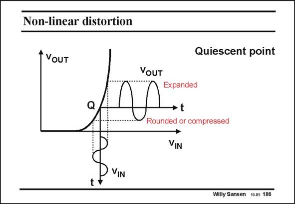

# SANSEN-186 · Non-linear distortion

章节：18 基本晶体管电路的失真  
PDF 页：511；书本页：521；幻灯片编号：186  
状态：unreviewed



## 对应教材讲解

### PDF 511 · 书本 521

Nonlinear distortion on the other hand is generated by a nonlinear transfer curve, as shown in this slide. The output voltage is nonlinear in terms of the input voltage for this amplifier. This amplifier is biased at a specific point Q, the quiescent point. A sine waveform will generate an output waveform which is distorted. The bottom half is compressed, whereas the top half is expanded. The larger the amplitude of the input voltage, the more distorted the output voltage will be, as a larger fraction of the transfer curve is covered around point Q. Distortion levels will always increase for increasing input amplitudes.

## 公式／性能结论候选摘录

以下为规则截取的原文，尚未逐项判读。

- PDF 511: Distortion levels will always increase for increasing input amplitudes.

## 曲线结论候选摘录

以下为规则截取的原文，尚未逐项判读。

- PDF 511: Nonlinear distortion on the other hand is generated by a nonlinear transfer curve, as shown in this slide.
- PDF 511: The larger the amplitude of the input voltage, the more distorted the output voltage will be, as a larger fraction of the transfer curve is covered around point Q.

## 原文条件与近似候选摘录

以下为规则截取的原文，尚未逐项判读。

（未由规则找到；不代表原页没有此类内容。）

## 幻灯片 OCR（未校正）

```text
Non-linear distortion
t VouT
Quiescent point
Expanded
→ t
VIN
Willy Sansen 10.05 186
```

数学上下标、分数及正负号以原图为准。电路图已保留；未核对的连接不输出成可仿真 netlist。
