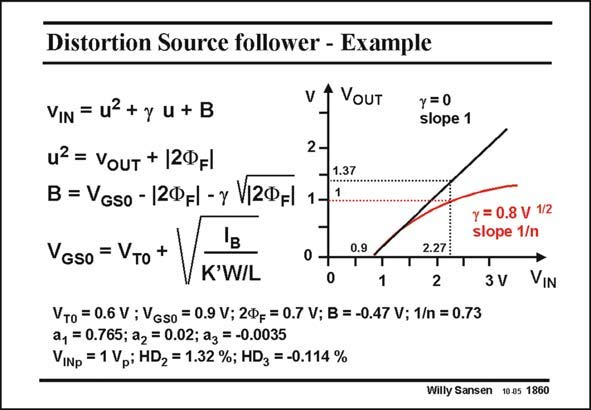

# SANSEN-1860 · Distortion Source follower - Example

章节：18 基本晶体管电路的失真  
PDF 页：538；书本页：548；幻灯片编号：1860  
状态：unreviewed



## 对应教材讲解

### PDF 538 · 书本 548

This nonlinear relationship is plotted in this slide. The slope of this curve decreases for larger input and output voltages. It is actually 1/n in which n contains g (see Chapter 1). This nonlinear relationship gives rise to a power series. The coefficients are given for specific values of the transistor parameters. It is obvious that a source follower, which cannot be embedded in a separate well, cannot be used, if distortion is of any concern!

## 公式／性能结论候选摘录

以下为规则截取的原文，尚未逐项判读。

- PDF 538: The slope of this curve decreases for larger input and output voltages.

## 曲线结论候选摘录

以下为规则截取的原文，尚未逐项判读。

- PDF 538: This nonlinear relationship is plotted in this slide.
- PDF 538: The slope of this curve decreases for larger input and output voltages.

## 原文条件与近似候选摘录

以下为规则截取的原文，尚未逐项判读。

（未由规则找到；不代表原页没有此类内容。）

## 幻灯片 OCR（未校正）

```text
Distortion Source follower - Example
VIN = u2 + y u + B
u? = VouT + |2ФFl
2-
B = Vgso - |2ФFl - y V|2ФFI
1
v t VouT
1.37
VGs0 = VTo +
y = 0
slope 1
B
K'W/L
0.9
2.27₴
0
1
2
V T0 = 0.6 V ; VGSo = 0.9 V; 2Фg = 0.7 V; B = -0.47 V; 1/n = 0.73
a1 = 0.765; a2 = 0.02; a3
=-0.0035
VINp = 1 Vp; HD2 = 1.32 %; HD3 = -0.114 %
y = 0.8 V 1/2
slope 1/n
3 V
VIN
Willy Sansen 10.05 1860
```

数学上下标、分数及正负号以原图为准。电路图已保留；未核对的连接不输出成可仿真 netlist。
