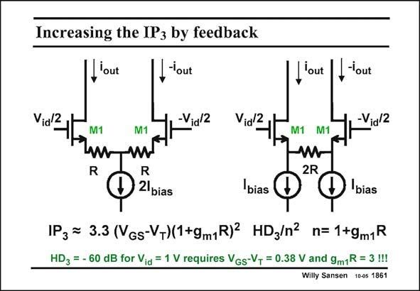

# SANSEN-1861 · Increasing the IP3 by feedback

章节：18 基本晶体管电路的失真  
PDF 页：539；书本页：549；幻灯片编号：1861  
状态：unreviewed



## 对应教材讲解

### PDF 538 · 书本 548

The inclusion of series resistors in the source is used very often to enlarge the input range of a differential pair. In principle this can be done by taking large values of V −V . If this is not GS T sufficient, series resistors R must be inserted.

### PDF 539 · 书本 549

The IM is now reduced 3 or the IP is increased. 3 Actually, there are two possible realizations of the same principle. For smallsignal performance they are almost the same. Actually, the circuit with a single resistor 2R (on the right) has the advantage that we do not have to try to match two separate resistors. On the other hand, the output capacitances of the bias current sources I will limit bias the high-frequency performance, which is not the case for the left circuit. The main difference however, is that for the left circuit, the DC bias current I flows through bias the resistor R, which is not the case on the right. For large resistors R and low supply voltages, the circuit on the right is the better one. Differential amplifiers with a large input range, and hence low distortion, are called transconductors. They are used intensively for continuous-time filters, discussed in the next Chapter.

## 公式／性能结论候选摘录

以下为规则截取的原文，尚未逐项判读。

- PDF 539: The IM is now reduced 3 or the IP is increased. 3 Actually, there are two possible realizations of the same principle.
- PDF 539: On the other hand, the output capacitances of the bias current sources I will limit bias the high-frequency performance, which is not the case for the left circuit.

## 曲线结论候选摘录

以下为规则截取的原文，尚未逐项判读。

（未由规则找到；不代表原页没有此类内容。）

## 原文条件与近似候选摘录

以下为规则截取的原文，尚未逐项判读。

（未由规则找到；不代表原页没有此类内容。）

## 幻灯片 OCR（未校正）

```text
Increasing the IP3 by feedback
'out
Via/2
,'out
-Vid 2
J'out
'out
Vid2,
-Vid 2
M1
M1
M1 M1
R
R
2lbias
2R
bias
bias
1P3 = 3.3 (VGs-V-)(1+9m1R) HD3/n2 n= 1+9m1R
HD3 = - 60 dB for Vid = 1 V requires Vgs-V+ = 0.38 V and 9m1R = 3 !!!
Willy Sansen 100s 1861
```

数学上下标、分数及正负号以原图为准。电路图已保留；未核对的连接不输出成可仿真 netlist。
