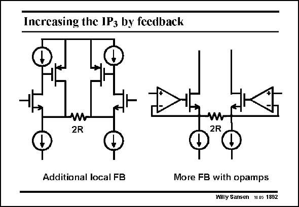

# SANSEN-1862 · Increasing the IPs by feedback

章节：18 基本晶体管电路的失真  
PDF 页：539；书本页：549；幻灯片编号：1862  
状态：unreviewed



## 对应教材讲解

### PDF 539 · 书本 549

Because of the limited supply voltage, very large value of resistor R cannot be used. Additional feedback is now required as shown in this slide. The purpose of all such circuits is to increase the loop gain to reduce the distortion. This can be done by addition of just one or two transistors in the feedback loop, as shown on the left, or by an inclusion of a full operational amplifier, as shown on the right. In the latter case, the loop gain at low frequencies is very high. As a result the differential input voltage is enforced upon the resistor 2R, giving rise to a very linear voltage to current conversion. For a high-frequency transconductor the circuit on the left may be preferred, as its loop gain may be higher at high frequencies.

## 公式／性能结论候选摘录

以下为规则截取的原文，尚未逐项判读。

- PDF 539: Because of the limited supply voltage, very large value of resistor R cannot be used.
- PDF 539: The purpose of all such circuits is to increase the loop gain to reduce the distortion.
- PDF 539: In the latter case, the loop gain at low frequencies is very high.
- PDF 539: As a result the differential input voltage is enforced upon the resistor 2R, giving rise to a very linear voltage to current conversion.
- PDF 539: For a high-frequency transconductor the circuit on the left may be preferred, as its loop gain may be higher at high frequencies.

## 曲线结论候选摘录

以下为规则截取的原文，尚未逐项判读。

（未由规则找到；不代表原页没有此类内容。）

## 原文条件与近似候选摘录

以下为规则截取的原文，尚未逐项判读。

（未由规则找到；不代表原页没有此类内容。）

## 幻灯片 OCR（未校正）

```text
Increasing the IPs by feedback
w
2R
2R
Additional local FB
More FB with opamps
Willy Sansen 10 05 1852
```

数学上下标、分数及正负号以原图为准。电路图已保留；未核对的连接不输出成可仿真 netlist。
