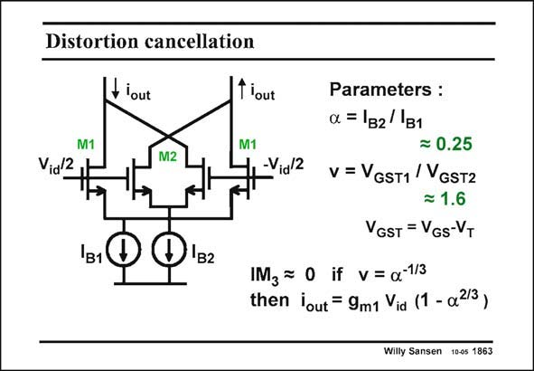

# SANSEN-1863 · Distortion cancellation

章节：18 基本晶体管电路的失真  
PDF 页：540；书本页：550；幻灯片编号：1863  
状态：unreviewed



## 对应教材讲解

### PDF 540 · 书本 550

Transconductors can also suppress the distortion by cancellation, rather than by local feedback. An often used example is given in this slide. It is actually a MOST version of the well known bipolar Gilbert multiplier (JSSC Dec. 68, 365–373). It is asymmetrical, however. It consists of two differential pairs with transistors M1 and M2, the second of which has smaller g ’s and is cross-coupled. m This cross-coupling allows the reduction of the IM3 to zero but also reduces the signal amplitude itself. There are actually two design parameters, i.e. the ratio a of the two biasing currents I , and B the ratio v of the two values of V −V . They are linked by a simple expression for zero IM . GS T 3 For example, for a=0.25, the ratio v must be 1.6 (for example, V −V =0.2 and 0.32 V). GS T Obviously, the cancellation will never be perfect. Mismatch will play a role.

## 公式／性能结论候选摘录

以下为规则截取的原文，尚未逐项判读。

（未由规则找到；不代表原页没有此类内容。）

## 曲线结论候选摘录

以下为规则截取的原文，尚未逐项判读。

（未由规则找到；不代表原页没有此类内容。）

## 原文条件与近似候选摘录

以下为规则截取的原文，尚未逐项判读。

（未由规则找到；不代表原页没有此类内容。）

## 幻灯片 OCR（未校正）

```text
Distortion cancellation
f lout
M1
1'out
M1
Via/2
M2
'B2
Parameters :
a = в2 в1
-Via12
= 0.25
v = VGST1 / VGsT2
≥ 1.6
VGST = VGs-VT
IMz= 0 if v =a-1/3
then lout = 9m1 Via (1 - a2/3)
Willy Sansen 10-0s 1863
```

数学上下标、分数及正负号以原图为准。电路图已保留；未核对的连接不输出成可仿真 netlist。
