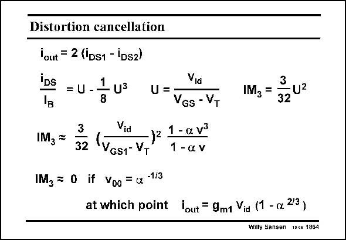

# SANSEN-1864 · Distortion cancellation

章节：18 基本晶体管电路的失真  
PDF 页：540；书本页：550；幻灯片编号：1864  
状态：unreviewed



## 对应教材讲解

### PDF 540 · 书本 550

The expressions for the differential output current and the IM are given in 3 this slide. It is clear that IM 3 depends on the relative current swing U as usual, but also on the two design parameters a and v. This additional fraction with a and v is plotted on the next slide. It is obvious, however, that it becomes zero if v equals a−1/3. It gives rise to a reduction of the signal amplitude itself. A compromise is therefore to be taken. For example, for a=0.25, the ratio v must be 1.6 (for example V −V =0.2 and 0.32 V). In GS T this case, the gain is reduced by a2/3 or by 12%, which is quite reasonable.

## 公式／性能结论候选摘录

以下为规则截取的原文，尚未逐项判读。

- PDF 540: It is clear that IM 3 depends on the relative current swing U as usual, but also on the two design parameters a and v.
- PDF 540: It is obvious, however, that it becomes zero if v equals a−1/3.
- PDF 540: A compromise is therefore to be taken.
- PDF 540: In GS T this case, the gain is reduced by a2/3 or by 12%, which is quite reasonable.

## 曲线结论候选摘录

以下为规则截取的原文，尚未逐项判读。

- PDF 540: This additional fraction with a and v is plotted on the next slide.

## 原文条件与近似候选摘录

以下为规则截取的原文，尚未逐项判读。

（未由规则找到；不代表原页没有此类内容。）

## 幻灯片 OCR（未校正）

```text
Distortion cancellation
lout = 2 (Ds1 - Ds2)
IDs
U
U =
Via
VGs - VT
IM3 =
3
32
Vid
-
VGs1- VT
1 - a v3
1 - a v
3
IM3 =
U2
32
IMz = 0 if Voo = ax -1/3
at which point lout = 9mt Via (1 - re 23)
Wilty Sansen 10.06 1864
```

数学上下标、分数及正负号以原图为准。电路图已保留；未核对的连接不输出成可仿真 netlist。
