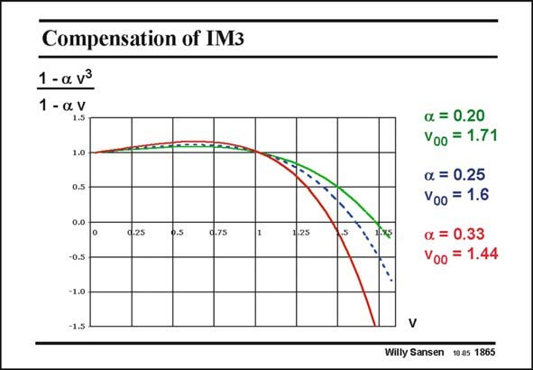

# SANSEN-1865 · Compensation of IM3 1 - a v3

章节：18 基本晶体管电路的失真  
PDF 页：541；书本页：551；幻灯片编号：1865  
状态：unreviewed



## 对应教材讲解

### PDF 541 · 书本 551

This fraction is plotted for different combinations of parameters a and v. It can be noted that the crossing point for zero is less sharp if smaller values are taken for a and therefore larger values of v. The range of V −V values over GS T which the same model holds is limited, however. This limits the value of a as well. This is why a good compromise for a=0.25, for which the ratio v must be 1.6. This gives very reasonable values for V −V =0.2 V and 0.32 V. GS T In this case the gain is reduced by a2/3 or by 40%, as shown next.

## 公式／性能结论候选摘录

以下为规则截取的原文，尚未逐项判读。

- PDF 541: It can be noted that the crossing point for zero is less sharp if smaller values are taken for a and therefore larger values of v.
- PDF 541: The range of V −V values over GS T which the same model holds is limited, however.
- PDF 541: This limits the value of a as well.
- PDF 541: GS T In this case the gain is reduced by a2/3 or by 40%, as shown next.

## 曲线结论候选摘录

以下为规则截取的原文，尚未逐项判读。

- PDF 541: This fraction is plotted for different combinations of parameters a and v.

## 原文条件与近似候选摘录

以下为规则截取的原文，尚未逐项判读。

（未由规则找到；不代表原页没有此类内容。）

## 幻灯片 OCR（未校正）

```text
Compensation of IM3
1 - a v3
1 - a. v
1.5
1.0
0.5
0.0
d.25
o.5
d.75
w.2s
-0.5
a = 0.20
V00 = 1.71
a. = 0.25
V00 = 1.6
a = 0.33
Voo
= 1.44
-1.0
-1.5
V
Willy Sansen 10.05 1865
```

数学上下标、分数及正负号以原图为准。电路图已保留；未核对的连接不输出成可仿真 netlist。
