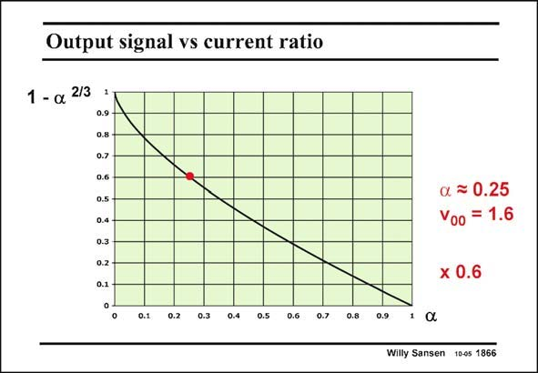

# SANSEN-1866 · Output signal vs current ratio

章节：18 基本晶体管电路的失真  
PDF 页：541；书本页：551；幻灯片编号：1866  
状态：unreviewed



## 对应教材讲解

### PDF 541 · 书本 551

The ratio by which the signal amplitude is reduced as a result of the cross-coupling is shown in this slide. The larger a is, the less signal amplitude remains. This is another reason not to choose too small a value of a. For a value of a=0.25, the output signal amplitude is reduced by a2/3 or by 40%, as shown in this slide.

## 公式／性能结论候选摘录

以下为规则截取的原文，尚未逐项判读。

- PDF 541: The ratio by which the signal amplitude is reduced as a result of the cross-coupling is shown in this slide.

## 曲线结论候选摘录

以下为规则截取的原文，尚未逐项判读。

（未由规则找到；不代表原页没有此类内容。）

## 原文条件与近似候选摘录

以下为规则截取的原文，尚未逐项判读。

（未由规则找到；不代表原页没有此类内容。）

## 幻灯片 OCR（未校正）

```text
Output signal vs current ratio
1 - a 2/3
0.9
0.8
0.7
0.6
0.5 -
0.4 -
0.3
0.2
0.1
o
a = 0.25
V00 = 1.6
x 0.6
0 0.1 0.2 0.3 0.4 0.5 0.6 0.7
0.81
0.9 1 C
Willy Sansen 10-05 1866
```

数学上下标、分数及正负号以原图为准。电路图已保留；未核对的连接不输出成可仿真 netlist。
