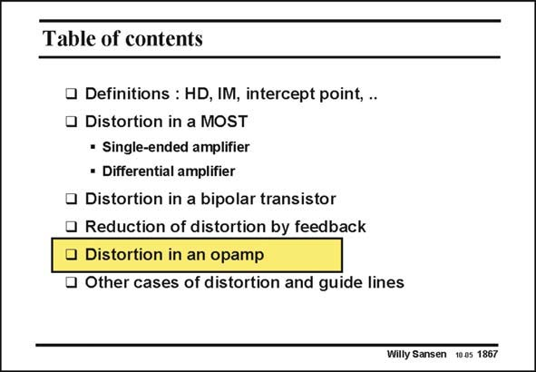

# SANSEN-1867 · Table of contents

章节：18 基本晶体管电路的失真  
PDF 页：542；书本页：552；幻灯片编号：1867  
状态：unreviewed



## 对应教材讲解

### PDF 542 · 书本 552

Now that we know how much the distortion can be reduced by means of feedback, let us apply this to the amplifier, which is always used with feedback, i.e. an operational amplifier. For a large output swing, a twostage Miller operation is normally used. First of all, we have to figure out what the signal voltage amplitudes are for both stages. This is achieved first at low frequencies, and then for all frequencies up to the GBW. It is clear that at high frequencies, the voltage gains are small, such that the input voltages increase. This will have two effects. The distortion per stage increases and secondly, the loop gain, which decreases the distortion, decreases. The distortion will now increase considerably at higher frequencies.

## 公式／性能结论候选摘录

以下为规则截取的原文，尚未逐项判读。

- PDF 542: It is clear that at high frequencies, the voltage gains are small, such that the input voltages increase.
- PDF 542: The distortion per stage increases and secondly, the loop gain, which decreases the distortion, decreases.
- PDF 542: The distortion will now increase considerably at higher frequencies.

## 曲线结论候选摘录

以下为规则截取的原文，尚未逐项判读。

（未由规则找到；不代表原页没有此类内容。）

## 原文条件与近似候选摘录

以下为规则截取的原文，尚未逐项判读。

（未由规则找到；不代表原页没有此类内容。）

## 幻灯片 OCR（未校正）

```text
Table of contents
• Definitions : HD, IM, intercept point, .
• Distortion in a MOST
• Single-ended amplifier
• Differential amplifier
• Distortion in a bipolar transistor
• Reduction of distortion by feedback
• Distortion in an opamp
• Other cases of distortion and guide lines
Willy Sansen 10.05 1867
```

数学上下标、分数及正负号以原图为准。电路图已保留；未核对的连接不输出成可仿真 netlist。
