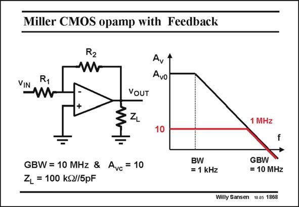

# SANSEN-1868 · Miller CMOS opamp with Feedback

章节：18 基本晶体管电路的失真  
PDF 页：542；书本页：552；幻灯片编号：1868  
状态：unreviewed



## 对应教材讲解

### PDF 542 · 书本 552

As an example, an opamp is taken with a 10 MHz GBW. It is set at a closed-loop gain of 10. Its bandwidth is therefore 1 MHz. A load is added, which mainly consists of a capacitance. As a result, some current will flow in the output transistors. For higher frequencies, this current will increase, leading to even more distortion. Let us now discover how distortion is affected by the frequency dependence of the gain blocks in the opamp.

## 公式／性能结论候选摘录

以下为规则截取的原文，尚未逐项判读。

- PDF 542: It is set at a closed-loop gain of 10.
- PDF 542: Its bandwidth is therefore 1 MHz.
- PDF 542: As a result, some current will flow in the output transistors.
- PDF 542: For higher frequencies, this current will increase, leading to even more distortion.
- PDF 542: Let us now discover how distortion is affected by the frequency dependence of the gain blocks in the opamp.

## 曲线结论候选摘录

以下为规则截取的原文，尚未逐项判读。

（未由规则找到；不代表原页没有此类内容。）

## 原文条件与近似候选摘录

以下为规则截取的原文，尚未逐项判读。

（未由规则找到；不代表原页没有此类内容。）

## 幻灯片 OCR（未校正）

```text
Miller CMOS opamp with Feedback
R2
W
Avt
Avo
VOUT
10
1 MHz
GBW = 10 MHz & Avc = 10
ZL = 100 kQ//5pF
BW
= 1 kHz
GBW
= 10 MHz
Willy Sansen 10.05 1868
```

数学上下标、分数及正负号以原图为准。电路图已保留；未核对的连接不输出成可仿真 netlist。
