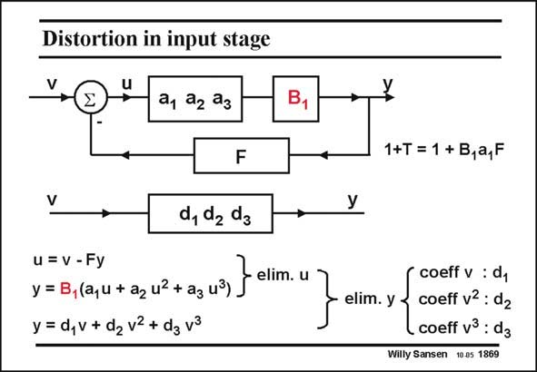

# SANSEN-1869 · Distortion in input stage

章节：18 基本晶体管电路的失真  
PDF 页：543；书本页：553；幻灯片编号：1869  
状态：unreviewed



## 对应教材讲解

### PDF 543 · 书本 553

An opamp is taken with two stages. We assume that only the first stage is nonlinear whereas the second stage has a fixed gain factor B1. By use of the same technique as before, the coefficients d of the resulting power series are easily obtained.

## 公式／性能结论候选摘录

以下为规则截取的原文，尚未逐项判读。

- PDF 543: We assume that only the first stage is nonlinear whereas the second stage has a fixed gain factor B1.

## 曲线结论候选摘录

以下为规则截取的原文，尚未逐项判读。

（未由规则找到；不代表原页没有此类内容。）

## 原文条件与近似候选摘录

以下为规则截取的原文，尚未逐项判读。

- PDF 543: We assume that only the first stage is nonlinear whereas the second stage has a fixed gain factor B1.

## 幻灯片 OCR（未校正）

```text
Distortion in input stage
a1 a2 ag
B,
F
d, de dg
u = V - Fy
y = B,(a,u + a2 u2 + a3 u3)
y = d,v+ dz v2 + dg v3
elim. u
1+T = 1 + B,a,F
elim. y
coeff v : dy
coeff v2 : d2
coeff v3 : d3
Willy Sansen 10.05 1869
```

数学上下标、分数及正负号以原图为准。电路图已保留；未核对的连接不输出成可仿真 netlist。
