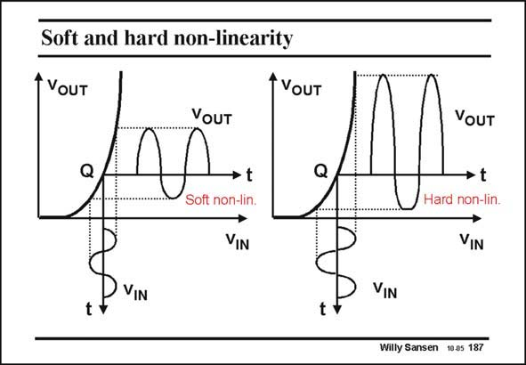

# SANSEN-187 · Soft and hard non-linearity

章节：18 基本晶体管电路的失真  
PDF 页：512；书本页：522；幻灯片编号：187  
状态：unreviewed



## 对应教材讲解

### PDF 512 · 书本 522

When the input voltage becomes too large, clipping occurs of the output voltage. This is called a hard nonlinearity. At this point, the distortion is very large, more than 10% for example. Few applications can tolerate such large values. We will limit ourselves to low levels of distortion, of the level of 0.1% (–60 dB) down to 0.001% (–100 dB) depending on the application. We are therefore only interested in soft nonlinearities, which give small amounts of distortion only.

## 公式／性能结论候选摘录

以下为规则截取的原文，尚未逐项判读。

- PDF 512: We will limit ourselves to low levels of distortion, of the level of 0.1% (–60 dB) down to 0.001% (–100 dB) depending on the application.
- PDF 512: We are therefore only interested in soft nonlinearities, which give small amounts of distortion only.

## 曲线结论候选摘录

以下为规则截取的原文，尚未逐项判读。

（未由规则找到；不代表原页没有此类内容。）

## 原文条件与近似候选摘录

以下为规则截取的原文，尚未逐项判读。

（未由规则找到；不代表原页没有此类内容。）

## 幻灯片 OCR（未校正）

```text
Soft and hard non-linearity
* VoUT
VOUT
→ t
VOUT
•t
VIN
VIN
t
Willy Sansen 10a5 187
```

数学上下标、分数及正负号以原图为准。电路图已保留；未核对的连接不输出成可仿真 netlist。
