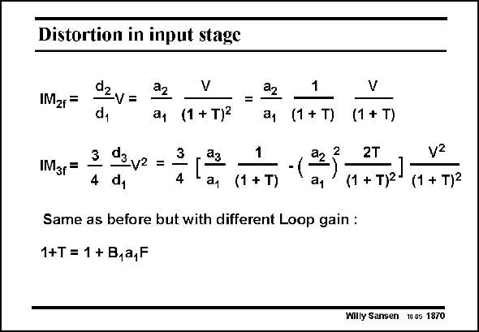

# SANSEN-1870 · Distortion in input stage

章节：18 基本晶体管电路的失真  
PDF 页：543；书本页：553；幻灯片编号：1870  
状态：unreviewed



## 对应教材讲解

### PDF 543 · 书本 553

The distortion components IM and IM are now easily 2 3 obtained. We find that they are exactly the same as for a single stage amplifier. The only difference is that the loop gain is 1+T larger. The gains of both stages are obviously present in the loop gain. The resulting distortion will be smaller because of the increased loop gain.

## 公式／性能结论候选摘录

以下为规则截取的原文，尚未逐项判读。

- PDF 543: The only difference is that the loop gain is 1+T larger.
- PDF 543: The gains of both stages are obviously present in the loop gain.
- PDF 543: The resulting distortion will be smaller because of the increased loop gain.

## 曲线结论候选摘录

以下为规则截取的原文，尚未逐项判读。

（未由规则找到；不代表原页没有此类内容。）

## 原文条件与近似候选摘录

以下为规则截取的原文，尚未逐项判读。

（未由规则找到；不代表原页没有此类内容。）

## 幻灯片 OCR（未校正）

```text
Distortion in input stage
IMzr=
IMar=
dzv=
a2
V
a1 (1 + T)2
=
22
đ1
3
4
dg,
V2 =
3
4
1|
a1
(1 + T)
1
(1 + T)
-
a2
2
a1
Same as before but with different Loop gain :
1+T = 1 + B,a,F
V
(1 + T)
2T
(1 + Т)2-
vz
(1 + T)2
Willy Sansen 10 05 1870
```

数学上下标、分数及正负号以原图为准。电路图已保留；未核对的连接不输出成可仿真 netlist。
