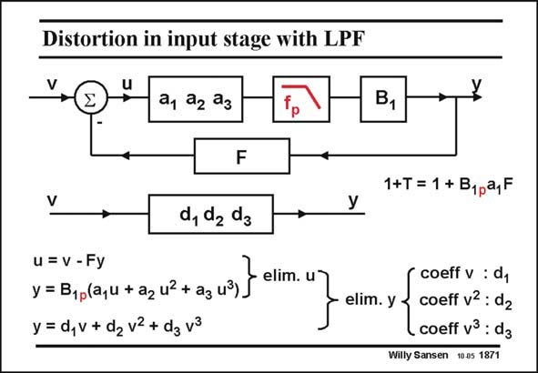

# SANSEN-1871 · Distortion in input stage with LPF

章节：18 基本晶体管电路的失真  
PDF 页：544；书本页：554；幻灯片编号：1871  
状态：unreviewed



## 对应教材讲解

### PDF 544 · 书本 554

A different result is obtained when a low-pass filter is inserted between both stages. This better resembles a two-stage amplifier. The compensation capacitance exerts a low-pass filter characteristic to the first stage. The low-pass filter has a pole at frequency f . It is p combined with the gain block B , to be denoted by 1 gain B , which is nothing 1p else than a filter block with low-frequency gain B . 1 A similar analysis as before again yields the coefficients d of the power series.

## 公式／性能结论候选摘录

以下为规则截取的原文，尚未逐项判读。

- PDF 544: It is p combined with the gain block B , to be denoted by 1 gain B , which is nothing 1p else than a filter block with low-frequency gain B . 1 A similar analysis as before again yields the coefficients d of the power series.

## 曲线结论候选摘录

以下为规则截取的原文，尚未逐项判读。

- PDF 544: The compensation capacitance exerts a low-pass filter characteristic to the first stage.

## 原文条件与近似候选摘录

以下为规则截取的原文，尚未逐项判读。

（未由规则找到；不代表原页没有此类内容。）

## 幻灯片 OCR（未校正）

```text
Distortion in input stage with LPF
a, a2 ag
B1
F
d, de dg
1+T = 1 + B1pa,F
u = V - Fy
y = B1p(a,u + a2 u} + ag u3)
y = d,v + d2 v2 + dg v3
elim. u
elim. y
coeff v : dy
coeff v2 : d2
coeff v3 : dg
Willy Sansen 10.05 1871
```

数学上下标、分数及正负号以原图为准。电路图已保留；未核对的连接不输出成可仿真 netlist。
