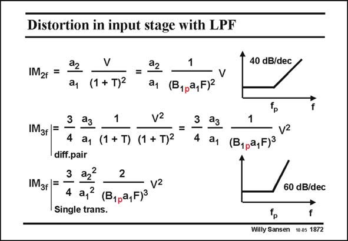

# SANSEN-1872 · Distortion in input stage with LPF

章节：18 基本晶体管电路的失真  
PDF 页：544；书本页：554；幻灯片编号：1872  
状态：unreviewed



## 对应教材讲解

### PDF 544 · 书本 554

Both distortion components IM and IM now contain 2 3 this low-pass filter characteristic, but inverted. Indeed a low-pass filter characteristic in the feedback loop yields a high pass filter characteristic. This is used to carry out noise shaping in all Sigma-delta modulators (see Chapter 21). In the IM characteristic, 3 the slope beyond pole frequency f , is 60 dB/decade, p which is quite steep indeed. Note that the rise starts at frequency f itself, without being affected by the loop gain. p Depending on the generator of distortion in the first stage, a different coefficient a emerges. For a differential pair it is evident that the third-order distortion of the input stage dominates.

## 公式／性能结论候选摘录

以下为规则截取的原文，尚未逐项判读。

- PDF 544: Note that the rise starts at frequency f itself, without being affected by the loop gain. p Depending on the generator of distortion in the first stage, a different coefficient a emerges.

## 曲线结论候选摘录

以下为规则截取的原文，尚未逐项判读。

- PDF 544: Both distortion components IM and IM now contain 2 3 this low-pass filter characteristic, but inverted.
- PDF 544: Indeed a low-pass filter characteristic in the feedback loop yields a high pass filter characteristic.
- PDF 544: In the IM characteristic, 3 the slope beyond pole frequency f , is 60 dB/decade, p which is quite steep indeed.

## 原文条件与近似候选摘录

以下为规则截取的原文，尚未逐项判读。

（未由规则找到；不代表原页没有此类内容。）

## 幻灯片 OCR（未校正）

```text
Distortion in input stage with LPF
IM2f =
ay (1+ T)2
22
1
a, (B1pa,F)2
40 dB/dec/
V
IM3f F -
3 аз
1
V2
4 ay (1 + T) (1 + T)2
diff.pair
3 аг?
2
IM3f|=
4 a,3 (B1ра, Fj3 V2
Single trans.
=
3 ₴з
1
4 ay
(B1pa, FJ3 Vz
60 dB/dec
f
Willy Sansen 10.a5 1872
```

数学上下标、分数及正负号以原图为准。电路图已保留；未核对的连接不输出成可仿真 netlist。
