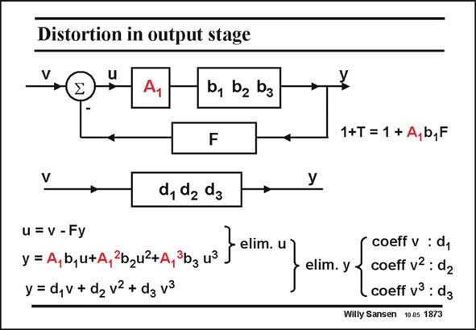

# SANSEN-1873 · Distortion in output stage

章节：18 基本晶体管电路的失真  
PDF 页：545；书本页：555；幻灯片编号：1873  
状态：unreviewed



## 对应教材讲解

### PDF 545 · 书本 555

Let us now keep the input stage linear. It has a fixed gain A . The second stage is 1 now non-linear, with coefficients b. A similar analysis as before again yields the coefficients d. Note however that the non-linear amplifier has a fairly large input voltage, this is due to the presence of gain block A . 1

## 公式／性能结论候选摘录

以下为规则截取的原文，尚未逐项判读。

- PDF 545: It has a fixed gain A .
- PDF 545: Note however that the non-linear amplifier has a fairly large input voltage, this is due to the presence of gain block A . 1

## 曲线结论候选摘录

以下为规则截取的原文，尚未逐项判读。

（未由规则找到；不代表原页没有此类内容。）

## 原文条件与近似候选摘录

以下为规则截取的原文，尚未逐项判读。

（未由规则找到；不代表原页没有此类内容。）

## 幻灯片 OCR（未校正）

```text
Distortion in output stage
b, b2 b3
F
d, d da
u = v - Fy
y = A,b,u+Aj
2b2u2+A,
3b3 u3
y = d,v + d2 v2 + dg v3
elim. u
1+T = 1 + A,b,F
elim. y
coeff v : dy
coeff v2 : d2
coeff v3 : d3
Willy Sansen 10.05 1873
```

数学上下标、分数及正负号以原图为准。电路图已保留；未核对的连接不输出成可仿真 netlist。
