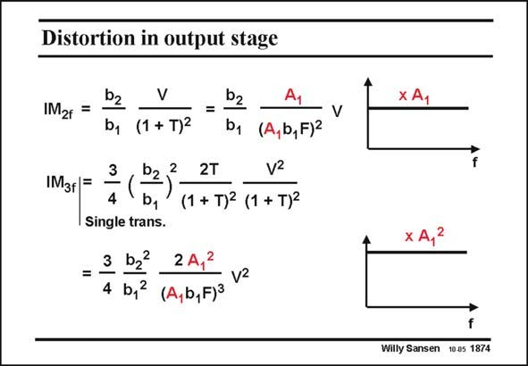

# SANSEN-1874 · Distortion in output stage

章节：18 基本晶体管电路的失真  
PDF 页：545；书本页：555；幻灯片编号：1874  
状态：unreviewed



## 对应教材讲解

### PDF 545 · 书本 555

The distortion components IM and IM are easily 2 3 found. The big difference with the previous results is that the first-stage gain A also 1 appears in the numerator, even squared for IM . This 3 is not unexpected, as the input signal is applied by gain A and then applied to 1 the non-linear amplifier with coefficients b.

## 公式／性能结论候选摘录

以下为规则截取的原文，尚未逐项判读。

- PDF 545: The big difference with the previous results is that the first-stage gain A also 1 appears in the numerator, even squared for IM .
- PDF 545: This 3 is not unexpected, as the input signal is applied by gain A and then applied to 1 the non-linear amplifier with coefficients b.

## 曲线结论候选摘录

以下为规则截取的原文，尚未逐项判读。

（未由规则找到；不代表原页没有此类内容。）

## 原文条件与近似候选摘录

以下为规则截取的原文，尚未逐项判读。

（未由规则找到；不代表原页没有此类内容。）

## 幻灯片 OCR（未校正）

```text
Distortion in output stage
b2
x A1
IM2f =
=
IM3f=
b, (1 + T)2
D2
2
4
b1
2T
(1 + T)2 (1 + T)2
Single trans.
3 b2 2A1
vz
4 b,2
(A,b,F)3
V
(A, b, F)2
Willy Sansen 10.05 1874
```

数学上下标、分数及正负号以原图为准。电路图已保留；未核对的连接不输出成可仿真 netlist。
