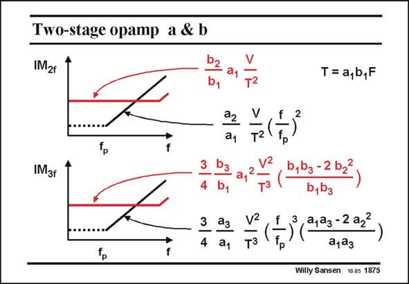

# SANSEN-1875 · Two-stage opamp a & b

章节：18 基本晶体管电路的失真  
PDF 页：546；书本页：556；幻灯片编号：1875  
状态：unreviewed



## 对应教材讲解

### PDF 545 · 书本 555

If both amplifiers are nonlinear, with a low-pass filter in between, we find the distortion components as given in this slide. The contributions of the first stage carry coefficients a (black) whereas the second stage coefficients b (red). It is clear that at low frequencies the distortion of the output stage dominates. The reason is that the input voltage of the output stage is fairly high, because of gain a . 1 At higher frequencies however, the distortion of the input stage dominates, because it has started increasing at frequency f , which is the dominant pole of the amplifier. p

### PDF 546 · 书本 556

If we take now a Miller opamp with a differential input stage (a =0) and a 2 single-ended output stage, then all IM is due to the 2 non-linearity of the output transistor, at least at low frequencies. This is also true at high frequencies as a differential pair does not generate second-order distortion. In practice, some other sources of distortion take over. The output conductance of the output transistor then starts coming in. The IM is also due to the 3 non-linearity of the output stage at low frequencies. At high frequencies the non-linearity of the input stage takes over.

## 公式／性能结论候选摘录

以下为规则截取的原文，尚未逐项判读。

- PDF 545: The reason is that the input voltage of the output stage is fairly high, because of gain a . 1 At higher frequencies however, the distortion of the input stage dominates, because it has started increasing at frequency f , which is the dominant pole of the amplifier. p

## 曲线结论候选摘录

以下为规则截取的原文，尚未逐项判读。

（未由规则找到；不代表原页没有此类内容。）

## 原文条件与近似候选摘录

以下为规则截取的原文，尚未逐项判读。

（未由规则找到；不代表原页没有此类内容。）

## 幻灯片 OCR（未校正）

```text
Two-stage opamp a & b
IM2f
b2
b,
a1
22
T= a,b,F
IM3f
3
-
4
a1
b,bg-2b22
b,b3
T (t3 ( 20-=2 02
ajaз
Willy Sansen 10.05 1875
```

数学上下标、分数及正负号以原图为准。电路图已保留；未核对的连接不输出成可仿真 netlist。
