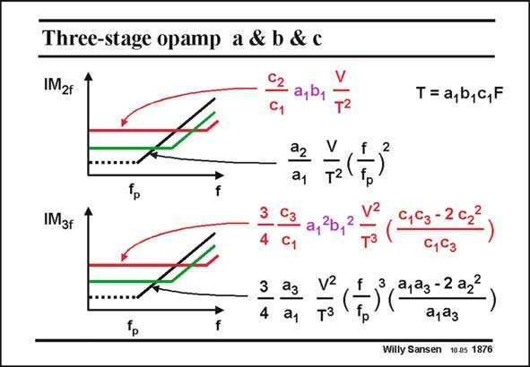

# SANSEN-1876 · Three-stage opamp a & b & c

章节：18 基本晶体管电路的失真  
PDF 页：546；书本页：556；幻灯片编号：1876  
状态：unreviewed



## 对应教材讲解

### PDF 546 · 书本 556

Similar results can be obtained for three-stage amplifiers (‘‘Distortion in Single-, Two-and Threestage amplifiers’’, Hernes, etal, TCAS-I, May 2005, 846–856, ‘‘Distortion analysis of Miller-compensated three-stage amplifiers, Cannizzaro, etal, TCAS-1, 2005). The contributions of the first stage carry coefficients a (black) whereas the output stage coefficients c (red). The intermediate second stage carries coefficients b (green). It is clear that at low frequencies the distortion of the output stage again dominates. The reason is that the input voltage of the output stage is fairly high, because of gains a and b . 1 1 At high frequencies, the distortion of the input stage takes over. The contributions of the second stage in the middle are always negligible. This is a result of the compensation scheme in which the lowest non-dominant pole is at a lower frequency than the one of the second stage. It is clear that a number of less important non-linearities have been neglected. The most important ones are the output conductances of the output transistors. Note, finally, that a simple rule can be deduced from these expressions. The distortion can always be calculated provided the relative current swing can be calculated. For this purpose, we

### PDF 547 · 书本 557

need to know the input voltage for each stage. The relative current swing then gives the distortion component. This value must now be divided by the value of the loop gain at that frequency. An example will clarify this.

## 公式／性能结论候选摘录

以下为规则截取的原文，尚未逐项判读。

- PDF 547: This value must now be divided by the value of the loop gain at that frequency.

## 曲线结论候选摘录

以下为规则截取的原文，尚未逐项判读。

（未由规则找到；不代表原页没有此类内容。）

## 原文条件与近似候选摘录

以下为规则截取的原文，尚未逐项判读。

- PDF 546: It is clear that a number of less important non-linearities have been neglected.
- PDF 546: The distortion can always be calculated provided the relative current swing can be calculated.

## 幻灯片 OCR（未校正）

```text
Three-stage opamp a & b & c
IM2f
G, a,0, F2
T= a,b,c,F
IM3f
4 a1
9-202
7 (43(9290-2
ajaз
Willy Sansen 10.05 1876
```

数学上下标、分数及正负号以原图为准。电路图已保留；未核对的连接不输出成可仿真 netlist。
