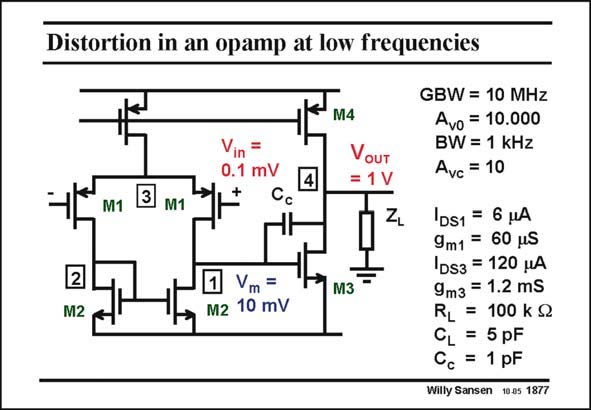

# SANSEN-1877 · Distortion in an opamp at low frequencies

章节：18 基本晶体管电路的失真  
PDF 页：547；书本页：557；幻灯片编号：1877  
状态：unreviewed



## 对应教材讲解

### PDF 547 · 书本 557

A two stage Miller opamp is taken with a 10 MHz GBW, set at a closed-loop gain of 10. Its bandwidth is therefore 1 MHz. All values of the gains and transistor parameters are given in this slide. Each stage has a lowfrequency gain of 100. For a signal output voltage of 1 V, the voltages at the input and in between the two stages, are easily calculated. What is the main source of distortion? This is clearly the output stage as it is driven by 10 mV, whereas the input stage only receives 0.1 mV input voltage. This is clear from the calculations. At higher frequencies however, the input signal required to deliver 1 V will increase, as the open-loop voltage decreases. It is not so obvious however, to determine what will be the signal voltage between the two stages. This is shown in the next slide.

## 公式／性能结论候选摘录

以下为规则截取的原文，尚未逐项判读。

- PDF 547: A two stage Miller opamp is taken with a 10 MHz GBW, set at a closed-loop gain of 10.
- PDF 547: Its bandwidth is therefore 1 MHz.
- PDF 547: Each stage has a lowfrequency gain of 100.
- PDF 547: At higher frequencies however, the input signal required to deliver 1 V will increase, as the open-loop voltage decreases.

## 曲线结论候选摘录

以下为规则截取的原文，尚未逐项判读。

（未由规则找到；不代表原页没有此类内容。）

## 原文条件与近似候选摘录

以下为规则截取的原文，尚未逐项判读。

（未由规则找到；不代表原页没有此类内容。）

## 幻灯片 OCR（未校正）

```text
Distortion in an opamp at low frequencies
Vin =
0.1 mV
3
M1
M1
Cc
2
M2
Vm =
M2 10 mV
M4
VouT
= 1 V
N
M3
GBW = 10 MHz
Avo = 10.000
BW = 1 kHz
Avc = 10
1DS1 = 6 HA
9m1 = 60 pS
DS3 = 120 pA
9m3 = 1.2 mS
RL
= 100 k S2
5 pF
= 1 pF
Willy Sansen 10.05 1877
```

数学上下标、分数及正负号以原图为准。电路图已保留；未核对的连接不输出成可仿真 netlist。
