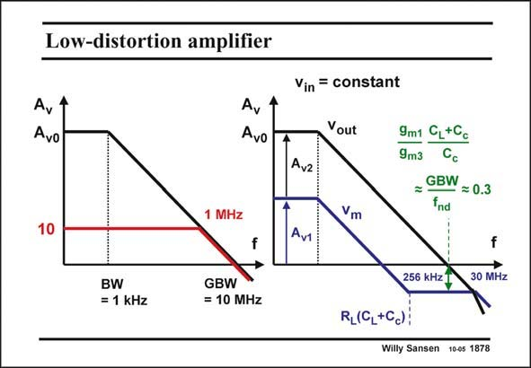

# SANSEN-1878 · Low-distortion amplifier

章节：18 基本晶体管电路的失真  
PDF 页：547；书本页：557；幻灯片编号：1878  
状态：unreviewed



## 对应教材讲解

### PDF 547 · 书本 557

On the left, the Bode diagram is given of the openand closed-loop gain. It shows what the output voltage is for a small input voltage, which increases in frequency. On the right, the voltage is added at the intermediate point. It shows that at low frequencies the gain of the first stage decreases. It is followed by a low-pass filter, with a pole equal to the dominant pole of the opamp. The gain across the output stage is constant.

### PDF 548 · 书本 558

This is true until the opamp reaches the frequency with time-constant R (C +C ). From here L L c on the gain of the second stage decreases as well. As a result, the distortion increases. Moreover, the loop gain has become quite small! The distortion will now increase quite steeply.

## 公式／性能结论候选摘录

以下为规则截取的原文，尚未逐项判读。

- PDF 547: On the left, the Bode diagram is given of the openand closed-loop gain.
- PDF 547: It shows what the output voltage is for a small input voltage, which increases in frequency.
- PDF 547: It shows that at low frequencies the gain of the first stage decreases.
- PDF 547: It is followed by a low-pass filter, with a pole equal to the dominant pole of the opamp.
- PDF 547: The gain across the output stage is constant.
- PDF 548: From here L L c on the gain of the second stage decreases as well.
- PDF 548: As a result, the distortion increases.
- PDF 548: Moreover, the loop gain has become quite small!

## 曲线结论候选摘录

以下为规则截取的原文，尚未逐项判读。

- PDF 547: On the left, the Bode diagram is given of the openand closed-loop gain.

## 原文条件与近似候选摘录

以下为规则截取的原文，尚未逐项判读。

（未由规则找到；不代表原页没有此类内容。）

## 幻灯片 OCR（未校正）

```text
Low-distortion amplifier
Ay
Avo
Avo
Vin = constant
Yout
Av2
9m1 C,+Cc
9m3 Cc
= GBW
fnd
= 0.3
1 MHz
10
Vm
Av
f
f
30 MHz
BW
= 1 kHz
GBW
= 10 MHz
RL(C,+Ca);
256 KHz 7
Willy Sansen 10-05 1878
```

数学上下标、分数及正负号以原图为准。电路图已保留；未核对的连接不输出成可仿真 netlist。
