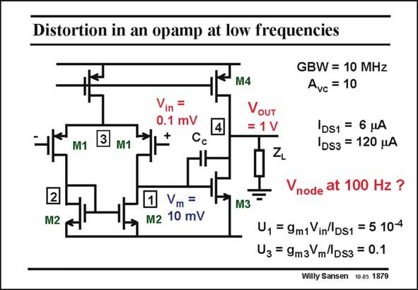

# SANSEN-1879 · Distortion in an opamp at low frequencies

章节：18 基本晶体管电路的失真  
PDF 页：548；书本页：558；幻灯片编号：1879  
状态：unreviewed



## 对应教材讲解

### PDF 548 · 书本 558

At low frequencies, for example at 100 Hz. The input signal levels are easily calculated for both the input stage and the output stage. The relative current swing for the input stage is now only 0.05% but it is 10% for the output stage. It is clear that the output transistor will generate a lot of secondorder distortion. It is given next.

## 公式／性能结论候选摘录

以下为规则截取的原文，尚未逐项判读。

（未由规则找到；不代表原页没有此类内容。）

## 曲线结论候选摘录

以下为规则截取的原文，尚未逐项判读。

（未由规则找到；不代表原页没有此类内容。）

## 原文条件与近似候选摘录

以下为规则截取的原文，尚未逐项判读。

（未由规则找到；不代表原页没有此类内容。）

## 幻灯片 OCR（未校正）

```text
Distortion in an opamp at low frequencies
Vin =
0.1 mV
3
M1
M1
2
M2
Vm =
M2 10 mV
M4
VouT
= 1 V
GBW = 10 MHz
Avc = 10
DS1 = 6 HA
1DS3 = 120 MA
Vnode at 100 Hz ?
M3
U1 = 9m1 Vin'DS1 = 5 104
U3 = 9m3 mDs3 = 0.1
Willy Sansen 10.05 1879
```

数学上下标、分数及正负号以原图为准。电路图已保留；未核对的连接不输出成可仿真 netlist。
