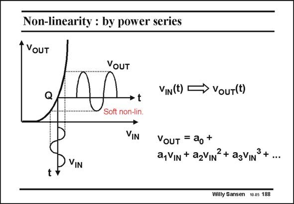

# SANSEN-188 · Non-linearity : by power series

章节：18 基本晶体管电路的失真  
PDF 页：512；书本页：522；幻灯片编号：188  
状态：unreviewed



## 对应教材讲解

### PDF 512 · 书本 522

Such soft nonlinearity can be described by means of a power series, as shown in this slide. The coefficient a gives 0 the DC output voltage in quiescent point Q. Coefficient a gives the 1 small-signal gain. It is the slope of the transfer curve in point Q. Coefficient a gives 2 the second-order nonlinearity. Actually, it represents the even-order nonlinearities, as coefficients a , a , etc. 4 4 become gradually smaller. In the same way, third-order coefficient a represents the higher-order ones a , a , etc. 3 5 7

## 公式／性能结论候选摘录

以下为规则截取的原文，尚未逐项判读。

- PDF 512: Coefficient a gives the 1 small-signal gain.

## 曲线结论候选摘录

以下为规则截取的原文，尚未逐项判读。

- PDF 512: It is the slope of the transfer curve in point Q.

## 原文条件与近似候选摘录

以下为规则截取的原文，尚未逐项判读。

（未由规则找到；不代表原页没有此类内容。）

## 幻灯片 OCR（未校正）

```text
Non-linearity : by power series
VoUT
VIN(t) -
→ VoUT(t)
→ t
VIN
VouT = ao+
a,VIN + azVIN?+ agVINS+...
Willy Sansen 10a5 188
```

数学上下标、分数及正负号以原图为准。电路图已保留；未核对的连接不输出成可仿真 netlist。
