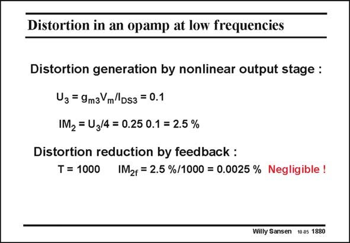

# SANSEN-1880 · Distortion in an opamp at low frequencies

章节：18 基本晶体管电路的失真  
PDF 页：548；书本页：558；幻灯片编号：1880  
状态：unreviewed



## 对应教材讲解

### PDF 548 · 书本 558

For a 10% relative current swing, the IM distortion is 2 easily found to be 1.5%. This distortion must now be divided by the loop gain at low frequencies. From the Bode diagram we find that this is 1000. The resulting IM is 2f 0.0025%, which is negligible indeed. First of all, little distortion is generated. Secondly, the loop gain at this frequency is quite large.

## 公式／性能结论候选摘录

以下为规则截取的原文，尚未逐项判读。

- PDF 548: This distortion must now be divided by the loop gain at low frequencies.
- PDF 548: Secondly, the loop gain at this frequency is quite large.

## 曲线结论候选摘录

以下为规则截取的原文，尚未逐项判读。

- PDF 548: From the Bode diagram we find that this is 1000.

## 原文条件与近似候选摘录

以下为规则截取的原文，尚未逐项判读。

（未由规则找到；不代表原页没有此类内容。）

## 幻灯片 OCR（未校正）

```text
Distortion in an opamp at low frequencies
Distortion generation by nonlinear output stage :
Uз = 9m3Vm/Ds3 = 0.1
IM2 = U3/4 = 0.25 0.1 = 2.5 %
Distortion reduction by feedback :
T = 1000
IM2r = 2.5 %/1000 = 0.0025 % Negligible !
Willy Sansen 10.05 1880
```

数学上下标、分数及正负号以原图为准。电路图已保留；未核对的连接不输出成可仿真 netlist。
