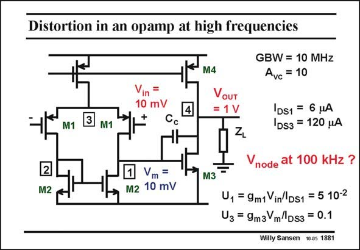

# SANSEN-1881 · Distortion in an opamp at high frequencies

章节：18 基本晶体管电路的失真  
PDF 页：549；书本页：559；幻灯片编号：1881  
状态：unreviewed



## 对应教材讲解

### PDF 549 · 书本 559

At a frequency of 100 kHz, on the other hand, which is not such a high frequency for this amplifier, the gain across the input stage decreases to about unity. The gain of the output stage is still approximately 100. The signal levels at the input and at the intermediate point are shown in this slide. It is clear that the distortion in the input stage will now be much larger, whereas the distortion on the output stage is the same as at 100 Hz. The relative current swing in the input stage has increased by a factor of 100. It is now 0.05. This is still too small to be able to play a role for distortion. The calculations show this.

## 公式／性能结论候选摘录

以下为规则截取的原文，尚未逐项判读。

- PDF 549: At a frequency of 100 kHz, on the other hand, which is not such a high frequency for this amplifier, the gain across the input stage decreases to about unity.
- PDF 549: The gain of the output stage is still approximately 100.
- PDF 549: The relative current swing in the input stage has increased by a factor of 100.

## 曲线结论候选摘录

以下为规则截取的原文，尚未逐项判读。

（未由规则找到；不代表原页没有此类内容。）

## 原文条件与近似候选摘录

以下为规则截取的原文，尚未逐项判读。

- PDF 549: The gain of the output stage is still approximately 100.
- PDF 549: It is clear that the distortion in the input stage will now be much larger, whereas the distortion on the output stage is the same as at 100 Hz.

## 幻灯片 OCR（未校正）

```text
Distortion in an opamp at high frequencies
Vin =
10 mV
3
M1
M1
2
M2
Vm =
M2 10 mV
M4
VoUT
= 1 V
GBW = 10 MHz
Avc = 10
DS1 = 6 HA
1DS3 = 120 HA
node at 100 kHz ?
M3
U, = 9m1 Vin'Ds1 = 5 10-2
U3 = 9m3 mDs3 = 0.1
Willy Sansen 10.05 1881
```

数学上下标、分数及正负号以原图为准。电路图已保留；未核对的连接不输出成可仿真 netlist。
