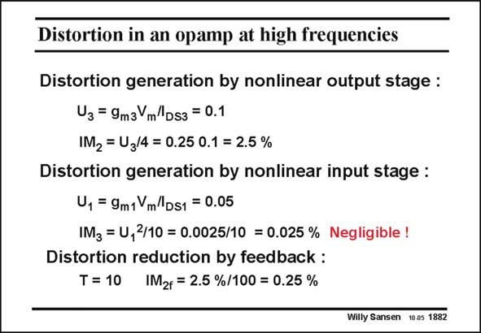

# SANSEN-1882 · Distortion in an opamp at high frequencies

章节：18 基本晶体管电路的失真  
PDF 页：549；书本页：559；幻灯片编号：1882  
状态：unreviewed



## 对应教材讲解

### PDF 549 · 书本 559

Indeed, the IM2 distortion of the second stage is the same as mentioned previously. The third-order distortion of the differential input stage is still negligible. Higher frequencies would be needed to make the distortion of the first stage dominant. However, the loop gain at this frequency is only 10. As a result, the IM is a lot 2f larger, i.e. 0.25% rather than 0.0025% at low frequencies. This is only a result of the reduced loop gain. At even higher frequencies, the loop gain becomes even smaller. In addition the input signals of both stages increase further, giving rise to a steep increase of the distortion. This is shown experimentally next.

## 公式／性能结论候选摘录

以下为规则截取的原文，尚未逐项判读。

- PDF 549: However, the loop gain at this frequency is only 10.
- PDF 549: As a result, the IM is a lot 2f larger, i.e. 0.25% rather than 0.0025% at low frequencies.
- PDF 549: This is only a result of the reduced loop gain.
- PDF 549: At even higher frequencies, the loop gain becomes even smaller.
- PDF 549: In addition the input signals of both stages increase further, giving rise to a steep increase of the distortion.

## 曲线结论候选摘录

以下为规则截取的原文，尚未逐项判读。

（未由规则找到；不代表原页没有此类内容。）

## 原文条件与近似候选摘录

以下为规则截取的原文，尚未逐项判读。

（未由规则找到；不代表原页没有此类内容。）

## 幻灯片 OCR（未校正）

```text
Distortion in an opamp at high frequencies
Distortion generation by nonlinear output stage :
Uз = 9m3 m Ds3 = 0.1
IM2 = U3/4 = 0.25 0.1 = 2.5 %
Distortion generation by nonlinear input stage :
U, = 9m1Ym/Ds1 = 0.05
IM3 = U,2/10 = 0.0025/10 = 0.025% Negligible!
Distortion reduction by feedback :
T = 10 IM2f = 2.5 %/100 = 0.25 %
Willy Sansen 10.05 1882
```

数学上下标、分数及正负号以原图为准。电路图已保留；未核对的连接不输出成可仿真 netlist。
