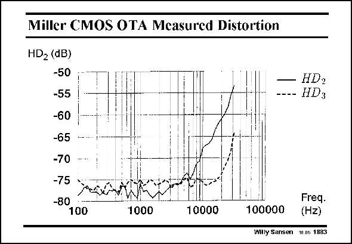

# SANSEN-1883 · Miller CMOS OTA Mcasured Distortion

章节：18 基本晶体管电路的失真  
PDF 页：550；书本页：560；幻灯片编号：1883  
状态：unreviewed



## 对应教材讲解

### PDF 550 · 书本 560

This is an experimental result for a two-stage opamp, with a GBW of 1 MHz. It is clear that secondorder distortion is dominant. It is generated by the output stage. Its slope is close to 40 dB/decade as expected. The third-order distortion is visible at higher frequencies but never dominant. Its slope is even higher. For frequencies lower than about 7 kHz, the distortions drown in the noise. No reliable measurements of distortion are possible here.

## 公式／性能结论候选摘录

以下为规则截取的原文，尚未逐项判读。

（未由规则找到；不代表原页没有此类内容。）

## 曲线结论候选摘录

以下为规则截取的原文，尚未逐项判读。

- PDF 550: Its slope is close to 40 dB/decade as expected.
- PDF 550: Its slope is even higher.

## 原文条件与近似候选摘录

以下为规则截取的原文，尚未逐项判读。

（未由规则找到；不代表原页没有此类内容。）

## 幻灯片 OCR（未校正）

```text
Miller CMOS OTA Mcasured Distortion
HD2 (dB)
-50
-55
-60
-65
-70
-75
-80
100
1000
10000
HD2
HD3
100000
Freq•
(Hz)
Willy Sansen 1.ng 1883
```

数学上下标、分数及正负号以原图为准。电路图已保留；未核对的连接不输出成可仿真 netlist。
