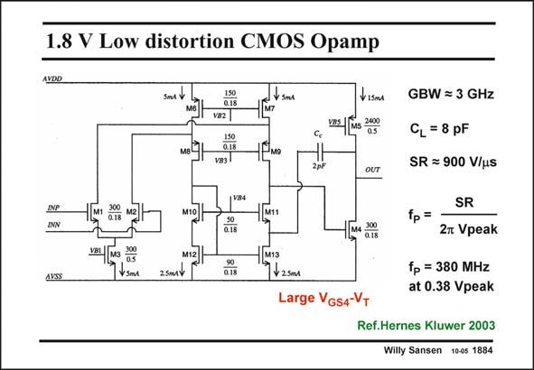

# SANSEN-1884 · 1.8 V Low distortion CMOS Opamp

章节：18 基本晶体管电路的失真  
PDF 页：550；书本页：560；幻灯片编号：1884  
状态：unreviewed



## 对应教材讲解

### PDF 550 · 书本 560

An example of a two-stage opamp with low distortion is shown in this slide. The first stage is a conventional folded cascode. It is followed by a secondstage without cascodes for large output swing. For low distortion at intermediate frequencies, the GBW must be as high as possible. To avoid Slew-Rate induced distortion, the slope of the sine wave going through zero must be less than the Slew Rate. The frequency at which this happens is reached at 380 MHz for a 0.38 V peak output voltage. It is clear that such an amplifier consumes a lot of power, i.e. 2.5 mA in each input transistor and 15 mA in the output transistors, which is 25 mA altogether on a 1.8 V supply voltage. This gives a FOM of only 1 MHzpF/mA. The distortion is very low however, as shown next.

## 公式／性能结论候选摘录

以下为规则截取的原文，尚未逐项判读。

（未由规则找到；不代表原页没有此类内容。）

## 曲线结论候选摘录

以下为规则截取的原文，尚未逐项判读。

- PDF 550: To avoid Slew-Rate induced distortion, the slope of the sine wave going through zero must be less than the Slew Rate.
- PDF 550: The frequency at which this happens is reached at 380 MHz for a 0.38 V peak output voltage.

## 原文条件与近似候选摘录

以下为规则截取的原文，尚未逐项判读。

（未由规则找到；不代表原页没有此类内容。）

## 幻灯片 OCR（未校正）

```text
1.8 V Low distortion CMOS Opamp
AVDD
SmA
ISO
0.18
V82
1.S0
0.18
VB3
2pF
INP
INN
MIs
VBL
AVSS
1з 300
V SmA
2SMMV
я|8
8|B
2.5ml
Large VGs4-VT
V 15mл
GBW = 3 GHz
YEs
Ms 240
OUT
M ais
Q.18
C=8 pF
SR = 900 V/us
SR
fp=
2 Vpeak
fp = 380 MHz
at 0.38 Vpeak
Ref.Hernes Kluwer 2003
Willy Sansen 10-05 1884
```

数学上下标、分数及正负号以原图为准。电路图已保留；未核对的连接不输出成可仿真 netlist。
