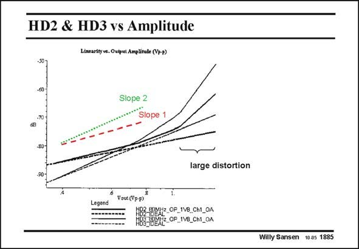

# SANSEN-1885 · HD2 & HD3 vs Amplitude Lintarity ve. Oatput Amplitude (V7-2)

章节：18 基本晶体管电路的失真  
PDF 页：551；书本页：561；幻灯片编号：1885  
状态：unreviewed



## 对应教材讲解

### PDF 551 · 书本 561

The distortion components HD and HD are plotted 2 3 on a log-log-scale to verify the slopes. The slopes themselves are also added. It is clear that the slopes are correct over the whole range of input amplitudes, at least for HD . 2 For HD the slope is cor- 3 rect up to about 0.8 V , ptp beyond which there is a slight increase. Beyond 1.2 V there is a sharp ptp increase. We enter the region of hard non-linearity. This is probably caused by a cascode coming out of the strong-inversion region. Curves at a higher frequency (80 MHz) are given as well. Better curves versus frequency are shown next.

## 公式／性能结论候选摘录

以下为规则截取的原文，尚未逐项判读。

- PDF 551: It is clear that the slopes are correct over the whole range of input amplitudes, at least for HD . 2 For HD the slope is cor- 3 rect up to about 0.8 V , ptp beyond which there is a slight increase.
- PDF 551: Beyond 1.2 V there is a sharp ptp increase.

## 曲线结论候选摘录

以下为规则截取的原文，尚未逐项判读。

- PDF 551: The distortion components HD and HD are plotted 2 3 on a log-log-scale to verify the slopes.
- PDF 551: It is clear that the slopes are correct over the whole range of input amplitudes, at least for HD . 2 For HD the slope is cor- 3 rect up to about 0.8 V , ptp beyond which there is a slight increase.
- PDF 551: Curves at a higher frequency (80 MHz) are given as well.
- PDF 551: Better curves versus frequency are shown next.

## 原文条件与近似候选摘录

以下为规则截取的原文，尚未逐项判读。

（未由规则找到；不代表原页没有此类内容。）

## 幻灯片 OCR（未校正）

```text
HD2 & HD3 vs Amplitude
Lintarity ve. Oatput Amplitude (V7-2)
Slope 2
Slope 1
large distortion
Legend
Vout (Yp-p)
102 epMHz_CP_1V8_Ch1_OA
B8-18942-CP_ IV8_Chi_OA
Willy Sansen 10.05 1885
```

数学上下标、分数及正负号以原图为准。电路图已保留；未核对的连接不输出成可仿真 netlist。
