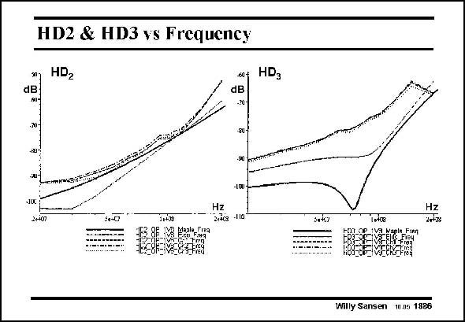

# SANSEN-1886 · HD2 & HD3 vs Frequency

章节：18 基本晶体管电路的失真  
PDF 页：551；书本页：561；幻灯片编号：1886  
状态：unreviewed



## 对应教材讲解

### PDF 551 · 书本 561

The experimental results versus frequency are shown in this slide. They are all taken for an output swing of 0.75 Volt . The labels Ch1, ptp Ch2 and Ch3 refer to different samples. The simulation results are carried out by means of Maple and by Eldo simulations are shown as well for comparison. The Maple simulations are actually symbolic simulations. They take into account only the first three terms of the power series. The Eldo simulations are transient circuit simulations to which a Fourier analysis is applied. The HD is dominated by the distortion in the output stage. At higher frequencies, it 2 increases because of the reduced loop gain. At lower frequencies it is underestimated because of various other sources of distortion. The HD shows a larger gap between simulated and measured values. At low frequencies the 3 HD is generated by the output stage whereas at high frequencies it is taken over by distortion 3 of the input stage. They have a different polarity. The cancellation point is clearly visible in Maple but much less in Eldo and in the experimental data. Also, several more sources of distortion are present, among which the output conductance distortion of the output transistors are the major ones.

## 公式／性能结论候选摘录

以下为规则截取的原文，尚未逐项判读。

- PDF 551: At higher frequencies, it 2 increases because of the reduced loop gain.

## 曲线结论候选摘录

以下为规则截取的原文，尚未逐项判读。

（未由规则找到；不代表原页没有此类内容。）

## 原文条件与近似候选摘录

以下为规则截取的原文，尚未逐项判读。

（未由规则找到；不代表原页没有此类内容。）

## 幻灯片 OCR（未校正）

```text
HD2 & HD3 vs Frequency
HD2
dB
+ HD3
dB
-20-
-10C
2-0?
se-07
Tring
-90
-LOU
Hz
2763 -10
Hz
2oF5s
BERDE
Willy Sansen 1.1g 1886
```

数学上下标、分数及正负号以原图为准。电路图已保留；未核对的连接不输出成可仿真 netlist。
