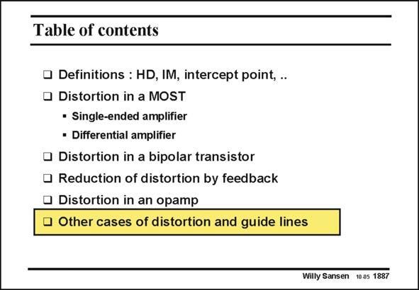

# SANSEN-1887 · Table of contents

章节：18 基本晶体管电路的失真  
PDF 页：552；书本页：562；幻灯片编号：1887  
状态：unreviewed



## 对应教材讲解

### PDF 552 · 书本 562

As distortion refers to any deviation from the ideal sine wave, for a sinusoidal input waveform, many other sources of distortion can occur. A few of them are listed here. This list will never be exhaustive however. Each new application may give rise to a new kind of distortion.

## 公式／性能结论候选摘录

以下为规则截取的原文，尚未逐项判读。

（未由规则找到；不代表原页没有此类内容。）

## 曲线结论候选摘录

以下为规则截取的原文，尚未逐项判读。

（未由规则找到；不代表原页没有此类内容。）

## 原文条件与近似候选摘录

以下为规则截取的原文，尚未逐项判读。

（未由规则找到；不代表原页没有此类内容。）

## 幻灯片 OCR（未校正）

```text
Table of contents
• Definitions : HD, IM, intercept point, .
• Distortion in a MOST
• Single-ended amplifier
• Differential amplifier
• Distortion in a bipolar transistor
• Reduction of distortion by feedback
• Distortion in an opamp
• Other cases of distortion and guide lines
Willy Sansen 10.05 1887
```

数学上下标、分数及正负号以原图为准。电路图已保留；未核对的连接不输出成可仿真 netlist。
