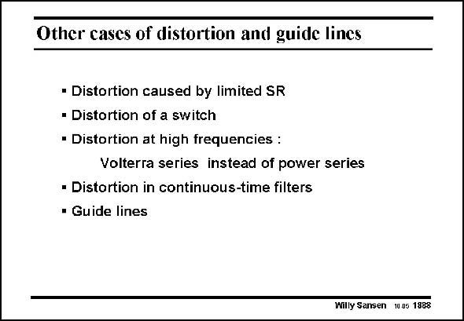

# SANSEN-1888 · Other cases of distortion and guide lines

章节：18 基本晶体管电路的失真  
PDF 页：552；书本页：562；幻灯片编号：1888  
状态：unreviewed



## 对应教材讲解

### PDF 552 · 书本 562

Too small a Slew-Rate can prevent to pass the high frequency slope of sine wave, which is reached when the sine wave goes through zero. When the Slew-Rate is much too low, a triangular waveform then results, giving excessive HD (more 3 than 10%). This is clearly to be avoided. A MOST as a switch will give distortion as well as its resistance depends on the V , which is the difference GS between the Gate drive voltage and the signal output voltage at the Source. This effect is especially detrimental at low supply voltages (<1.8 V). This will be discussed in more detail in Chapter 21. At high frequencies, it is actually no longer possible to use power series and phasors to correct the response for frequency dependence. The power series must be substituted by Volterra series. As they can only be applied to simple circuits, they are seldom used. In continuous-time filters, discussed in the next Chapter, some more techniques are used to cancel the distortion. This is possible provided sufficient matching can be reached. Some examples will be given in the next Chapter. Finally, some simple guidelines are added to allow reduction of distortion.

## 公式／性能结论候选摘录

以下为规则截取的原文，尚未逐项判读。

- PDF 552: A MOST as a switch will give distortion as well as its resistance depends on the V , which is the difference GS between the Gate drive voltage and the signal output voltage at the Source.
- PDF 552: At high frequencies, it is actually no longer possible to use power series and phasors to correct the response for frequency dependence.

## 曲线结论候选摘录

以下为规则截取的原文，尚未逐项判读。

- PDF 552: Too small a Slew-Rate can prevent to pass the high frequency slope of sine wave, which is reached when the sine wave goes through zero.

## 原文条件与近似候选摘录

以下为规则截取的原文，尚未逐项判读。

- PDF 552: This is possible provided sufficient matching can be reached.

## 幻灯片 OCR（未校正）

```text
Other cases of distortion and guide lines
• Distortion caused by limited SR
• Distortion of a switch
• Distortion at high frequencies :
Volterra series instead of power series
• Distortion in continuous-time filters
• Guide lines
Willy Sansen 10.05 1888
```

数学上下标、分数及正负号以原图为准。电路图已保留；未核对的连接不输出成可仿真 netlist。
