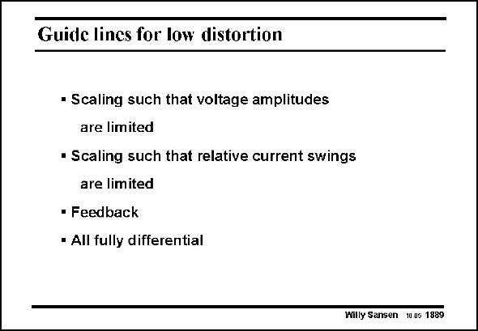

# SANSEN-1889 · Guide lines for low distortion

章节：18 基本晶体管电路的失真  
PDF 页：553；书本页：563；幻灯片编号：1889  
状态：unreviewed



## 对应教材讲解

### PDF 553 · 书本 563

Since distortion is proportional to both voltage and current swing, the first guidelines simply state that low-distortion performance can be reached when both swings are small. Distortion can always be reduced by application of feedback. This feedback causes a reduction in distortion, first by reducing the signal swing and on top of that, by dividing the distortion by the loop gain. Finally, second-order distortion can always be avoided by making all circuitry fully-differential. Obviously, the power consumption also increases and so does the input noise. However, the Signal-to-noise-anddistortion will increase. Mismatch will give some second-order distortion but it will usually be smaller than the third-order one.

## 公式／性能结论候选摘录

以下为规则截取的原文，尚未逐项判读。

- PDF 553: Since distortion is proportional to both voltage and current swing, the first guidelines simply state that low-distortion performance can be reached when both swings are small.
- PDF 553: This feedback causes a reduction in distortion, first by reducing the signal swing and on top of that, by dividing the distortion by the loop gain.
- PDF 553: Obviously, the power consumption also increases and so does the input noise.
- PDF 553: However, the Signal-to-noise-anddistortion will increase.

## 曲线结论候选摘录

以下为规则截取的原文，尚未逐项判读。

（未由规则找到；不代表原页没有此类内容。）

## 原文条件与近似候选摘录

以下为规则截取的原文，尚未逐项判读。

（未由规则找到；不代表原页没有此类内容。）

## 幻灯片 OCR（未校正）

```text
Guide lines for low distortion
• Scaling such that voltage amplitudes
are limited
• Scaling such that relative current swings
are limited
• Feedback
• All fully differential
Willy Sansen 10us 1889
```

数学上下标、分数及正负号以原图为准。电路图已保留；未核对的连接不输出成可仿真 netlist。
