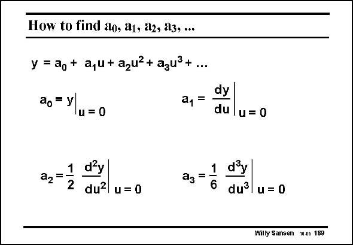

# SANSEN-189 · How to find ao, a1, a2, a3,...

章节：18 基本晶体管电路的失真  
PDF 页：513；书本页：523；幻灯片编号：189  
状态：unreviewed



## 对应教材讲解

### PDF 513 · 书本 523

For any nonlinear transfer curve, the coefficient a , a , 0 1 a , a , ... can easily be found 2 3 by taking derivatives. Coefficient a is simply 0 the DC value, which is reached for zero small signal input level u. Coefficient a is clearly 1 the first derivative of the output signal y with respect to the input signal u. The other coefficients are obtained as indicated. Corrections have to be made for the coefficients appearing during the derivation. It is clear that for coefficient a for example, the transfer curve 3 must be sufficiently smooth. Several MOST models were not that smooth at the cross-over points, prohibiting the calculation of coefficient a . 3

## 公式／性能结论候选摘录

以下为规则截取的原文，尚未逐项判读。

（未由规则找到；不代表原页没有此类内容。）

## 曲线结论候选摘录

以下为规则截取的原文，尚未逐项判读。

- PDF 513: For any nonlinear transfer curve, the coefficient a , a , 0 1 a , a , ... can easily be found 2 3 by taking derivatives.
- PDF 513: It is clear that for coefficient a for example, the transfer curve 3 must be sufficiently smooth.

## 原文条件与近似候选摘录

以下为规则截取的原文，尚未逐项判读。

（未由规则找到；不代表原页没有此类内容。）

## 幻灯片 OCR（未校正）

```text
How to find ao, a1, a2, a3,...
y = ag+ a,u+azu?+ azus+...
ao = y
1u = 0
a1 =
dy
du
u= 0
1 d'y
a2=
2
du? u= 0
ag = 1
d'y
dưl u = 0
Willy Sansen 100s 189
```

数学上下标、分数及正负号以原图为准。电路图已保留；未核对的连接不输出成可仿真 netlist。
