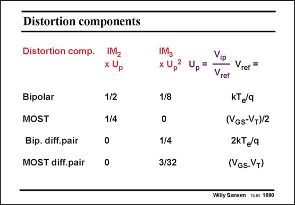

# SANSEN-1890 · Distortion components

章节：18 基本晶体管电路的失真  
PDF 页：553；书本页：563；幻灯片编号：1890  
状态：unreviewed



## 对应教材讲解

### PDF 553 · 书本 563

As a final overview, the distortion components are listed for all elementary circuits, first of all, without, and then with feedback. They all have been previously derived. For example, take the second-order distortion of a MOST. Its IM is 1/4 of U , 2 p in which U is the ratio of p the peak input voltage V ip divided by (V −V )/2. GS T Also, its IM is about 1/10 3 of U 2, in which U is the p p ratio of the peak input voltage V divided by ip (V −V ). GS T

## 公式／性能结论候选摘录

以下为规则截取的原文，尚未逐项判读。

（未由规则找到；不代表原页没有此类内容。）

## 曲线结论候选摘录

以下为规则截取的原文，尚未逐项判读。

- PDF 553: Its IM is 1/4 of U , 2 p in which U is the ratio of p the peak input voltage V ip divided by (V −V )/2.
- PDF 553: GS T Also, its IM is about 1/10 3 of U 2, in which U is the p p ratio of the peak input voltage V divided by ip (V −V ).

## 原文条件与近似候选摘录

以下为规则截取的原文，尚未逐项判读。

（未由规则找到；不代表原页没有此类内容。）

## 幻灯片 OCR（未校正）

```text
Distortion components
Distortion comp.
IM2
x Up
1/2
1/4
IM3
x Up
2
1/8
Up=
Bipolar
MOST
Bip. diff.pair
MOST diff.pair
1/4
3/32
Vip
Vrer =
Vref
KTea
(VGs-V+)/2
2kT /4
(VGs-VT)
Willy Sansen 10.05 1890
```

数学上下标、分数及正负号以原图为准。电路图已保留；未核对的连接不输出成可仿真 netlist。
