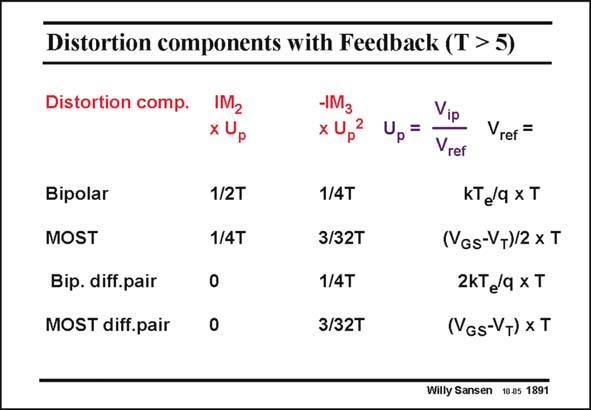

# SANSEN-1891 · Distortion components with Feedback (T > 5)

章节：18 基本晶体管电路的失真  
PDF 页：554；书本页：564；幻灯片编号：1891  
状态：unreviewed



## 对应教材讲解

### PDF 554 · 书本 564

A similar Table is easily made for the distortion components with feedback. The loop gain is T. For example, the IM of 3 a single-MOST amplifier is about 1/10 of U 2, in which p U is the ratio of the peak p input voltage V divided by ip (V −V )/2, and divided by GS T T3. Two T’s comes from the reduction in current swing (through U ) and one of p them from the reduction in loop gain.

## 公式／性能结论候选摘录

以下为规则截取的原文，尚未逐项判读。

- PDF 554: The loop gain is T.
- PDF 554: Two T’s comes from the reduction in current swing (through U ) and one of p them from the reduction in loop gain.

## 曲线结论候选摘录

以下为规则截取的原文，尚未逐项判读。

- PDF 554: For example, the IM of 3 a single-MOST amplifier is about 1/10 of U 2, in which p U is the ratio of the peak p input voltage V divided by ip (V −V )/2, and divided by GS T T3.

## 原文条件与近似候选摘录

以下为规则截取的原文，尚未逐项判读。

（未由规则找到；不代表原页没有此类内容。）

## 幻灯片 OCR（未校正）

```text
Distortion components with Feedback (T > 5)
Distortion comp.
Bipolar
MOST
Bip. diff.pair
MOST diff.pair
IM2
x Up
1/2T
1/4T
-IM3
x Up
2
Up=
Vip
Vref
Vrer =
1/4T
3/32T
1/4T
KT/q xT
(VGs-VT)/2 x T
2KTe/q xT
3/32T
(VGs-VT) XT
Willy Sansen 10.05 1891
```

数学上下标、分数及正负号以原图为准。电路图已保留；未核对的连接不输出成可仿真 netlist。
