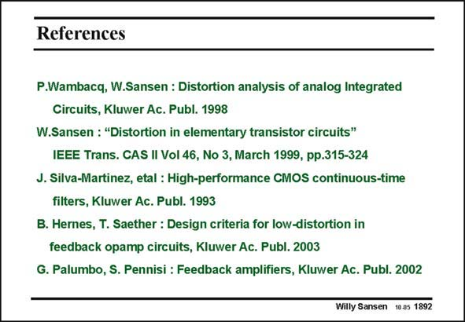

# SANSEN-1892 · References

章节：18 基本晶体管电路的失真  
PDF 页：554；书本页：564；幻灯片编号：1892  
状态：unreviewed



## 对应教材讲解

### PDF 554 · 书本 564

A few general references are listed on distortion. They speak for themselves.

## 公式／性能结论候选摘录

以下为规则截取的原文，尚未逐项判读。

（未由规则找到；不代表原页没有此类内容。）

## 曲线结论候选摘录

以下为规则截取的原文，尚未逐项判读。

（未由规则找到；不代表原页没有此类内容。）

## 原文条件与近似候选摘录

以下为规则截取的原文，尚未逐项判读。

（未由规则找到；不代表原页没有此类内容。）

## 幻灯片 OCR（未校正）

```text
References
P.Wambacq, W.Sansen : Distortion analysis of analog Integrated
Circuits, Kluwer Ac. Publ. 1998
W.Sansen : "Distortion in elementary transistor circuits"
IEEE Trans. CAS II Vol 46, No 3, March 1999, pp.315-324
J. Silva-Martinez, etal : High-performance CMOS continuous-time
filters, Kluwer Ac. Publ. 1993
B. Hernes, T. Saether : Design criteria for low-distortion in
feedback opamp circuits, Kluwer Ac. Publ. 2003
G. Palumbo, S. Pennisi : Feedback amplifiers, Kluwer Ac. Publ. 2002
Willy Sansen 10.05 1892
```

数学上下标、分数及正负号以原图为准。电路图已保留；未核对的连接不输出成可仿真 netlist。
