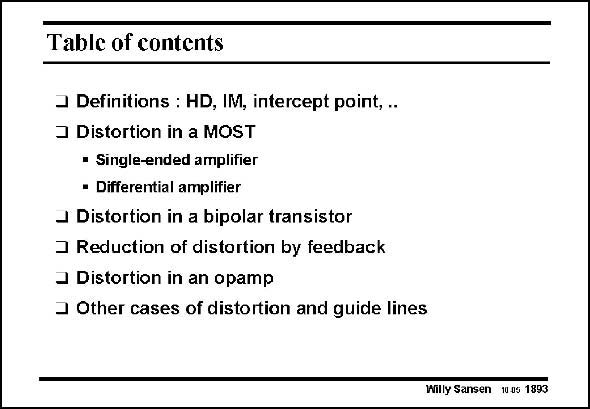

# SANSEN-1893 · Table of contents

章节：18 基本晶体管电路的失真  
PDF 页：555；书本页：565；幻灯片编号：1893  
状态：unreviewed



## 对应教材讲解

### PDF 555 · 书本 565

In this Chapter, an introduction is given on distortion caused by the weak nonlinearities of the transistors. The definitions of distortion have been given first. They are followed by distortion calculations of MOST and bipolar devices in both single and differential configurations. Considerable attention is paid to the reduction of distortion by feedback. Finally some guide lines and overview Tables are added to allow easy prediction of distortion levels in any kind of amplifier.

## 公式／性能结论候选摘录

以下为规则截取的原文，尚未逐项判读。

（未由规则找到；不代表原页没有此类内容。）

## 曲线结论候选摘录

以下为规则截取的原文，尚未逐项判读。

（未由规则找到；不代表原页没有此类内容。）

## 原文条件与近似候选摘录

以下为规则截取的原文，尚未逐项判读。

（未由规则找到；不代表原页没有此类内容。）

## 幻灯片 OCR（未校正）

```text
Table of contents
3 Definitions : HD, IM, intercept point, ..
J Distortion in a MOST
• Single-ended amplifier
• Differential amplifier
J Distortion in a bipolar transistor
3 Reduction of distortion by feedback
3 Distortion in an opamp
3 Other cases of distortion and guide lines
Willy Sansen 10 05 1893
```

数学上下标、分数及正负号以原图为准。电路图已保留；未核对的连接不输出成可仿真 netlist。
